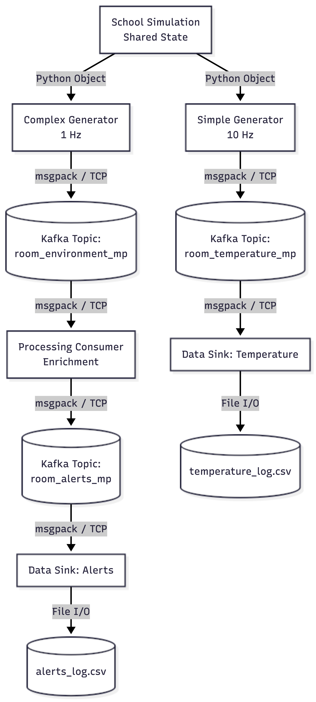

# 1. Architecture Overview & Component Diagram

---

# 2. Architecture and Design Overview (Questions & Answers)

**What are the tasks of the components?**
* **School Simulation:** Verwaltet den Status der Räume (Temperatur, Belegung, CO2, etc.) basierend auf einem simulierten Tagesablauf. Sie agiert als Ground Truth.
* **Generators (Producers):** Lesen den Raumstatus periodisch aus, verpacken die Daten (einfach vs. komplex) und senden sie an das Kafka-Cluster.
* **Processing Consumer:** Liest den komplexen Datenstrom, wertet Metriken aus (z. B. CO2-Gehalt > 1000 ppm) und reichert die Nachrichten mit Warnungen und Verarbeitungszeitstempeln an, bevor sie in ein neues Topic geschrieben werden.
* **Data Sinks:** Konsumieren Daten aus spezifischen Topics und persistieren sie kontinuierlich als `.csv`-Dateien auf der Festplatte.

**Which interfaces do the components have?**
* **Python Object Interface:** Die Generatoren greifen intern im Speicher auf die Objekte der `SchoolSimulation` zu.
* **Kafka Network Interface (TCP/IP):** Die Kommunikation zwischen Producers/Consumers und dem Kafka-Cluster läuft über TCP auf Port 9092.
* **Serialization Interface:** Daten werden vor dem Senden in das binäre **MessagePack**-Format (`msgpack`) serialisiert und beim Empfang deserialisiert. Wurden zuvor mit JSON serializiert.
* **File System Interface:** Die Data Sinks nutzen lokales File I/O (mit Python's `csv` Modul), um Daten auf das gemappte Docker-Volume zu schreiben.

**Why did you decide to use these components?**
* Die Entkopplung von Simulation und Datengenerierung erlaubt realistische, physikalisch korrelierende Sensordaten, ohne die Kafka-Logik zu verkomplizieren.
* Durch den *Processing Consumer* wird das Konzept der Stream-Verarbeitung (Lesen -> Bereichern -> Schreiben) demonstriert.
* *MessagePack* wurde anstelle von JSON gewählt (Bonus-Aufgabe), da es als binäres Format performanter ist und die Netzwerkbandbreite schont.

**Are there any other design decisions you have made? Which requirements does a component have?**
* **Shared State Design:** Anstatt zufällige Daten zu senden, lesen alle Generatoren von derselben Simulation. Dies sorgt dafür, dass Temperatur und CO2-Werte logisch zusammenpassen und nicht asynchron springen.
* **Graceful Shutdown:** Alle Kafka-Verbindungen (`consumer.close()`, `producer.flush()`) werden durch Exception-Handling sauber geschlossen, um Datenverlust beim Beenden der Container zu vermeiden.
* **Requirements:** Die Komponenten erfordern Python 3.11, die Bibliotheken `kafka-python` und `msgpack` sowie eine funktionierende Netzwerkverbindung zu den Kafka-Brokern.

**Which features of Kafka do you use and how does this correlate to the cluster / topic settings you choose?**
* **Topics:** Werden zur logischen Trennung der Datenströme genutzt (`room_temperature_mp`, `room_environment_mp`, `room_alerts_mp`).
* **Consumer Groups:** Jeder Consumer und Sink verwendet eine explizite `group_id` (z. B. `processing_group`, `sink_temp_group_mp`). Dies ermöglicht es Kafka, den Offset (welche Nachricht zuletzt gelesen wurde) zu speichern. So können Consumer horizontal skaliert werden oder nach einem Absturz genau dort weiterlesen, wo sie aufgehört haben.
* **Replication / HA:** Durch das Setup mit 3 Brokern und `KAFKA_OFFSETS_TOPIC_REPLICATION_FACTOR: 3` ist das Cluster ausfallsicher konfiguriert.

**Describe the Docker setup of your application.**
* Die Anwendung nutzt Docker Compose zur Orchestrierung.
* **Kafka Cluster:** Drei Broker laufen im modernen KRaft-Modus (ohne Zookeeper) zur reinen Datenverwaltung. Zusätzlich läuft `kafdrop` als UI-Monitor.
* **Application Services:** Für die Python-Logik wurde ein lokales Image (`python:3.11-slim`) mittels Dockerfile gebaut. Dieses Image wird von drei separaten Services (`data-generator`, `data-processor`, `data-sink`) gestartet, die somit als isolierte Microservices agieren.
* **Volumes:** Der Ordner `/app/data` im `data-sink` Container ist via Bind-Mount mit dem Host-System verbunden, um die CSV-Dateien dauerhaft zugänglich zu machen.