# Part 1: Kafka Cluster and Application Setup

## Einleitung: School Simulation – Luftqualitätsüberwachung in Schulgebäuden

### Ausgangslage

In Schulgebäuden verbringen hunderte Schülerinnen und Schüler sowie Lehrpersonen täglich mehrere Stunden in denselben Räumen. Die Qualität der Raumluft – beeinflusst durch Faktoren wie CO2-Konzentration, Temperatur, Luftfeuchtigkeit und Belegung – hat einen direkten Einfluss auf Konzentrationsfähigkeit, Wohlbefinden und Gesundheit. Besonders in der kalten Jahreszeit, wenn Fenster geschlossen bleiben, steigen die CO2-Werte oft unbemerkt auf kritische Werte an, was zu Müdigkeit, Kopfschmerzen und verminderter Leistungsfähigkeit führt.

### Problemstellung

Bisher fehlt in vielen Schulgebäuden ein kontinuierliches, automatisiertes Monitoring-System, das Sensordaten in Echtzeit erfasst, auswertet und bei kritischen Werten rechtzeitig warnt. Eine manuelle Überwachung ist aufgrund der Vielzahl an Räumen und der dynamischen Belegungssituation praktisch nicht umsetzbar. Das Ziel dieser Anwendung ist es, diese Lücke zu schliessen: Ein verteiltes Sensor-Netzwerk soll kontinuierlich Umgebungsdaten aus allen Räumen einer Schule erfassen, den Datenstrom in Echtzeit verarbeiten und bei Überschreitung definiertter Schwellenwerte (z.B. CO2 > 1000 ppm) automatisch Warnungen generieren.

### Daten der Anwendung

Die Anwendung simuliert eine Schule mit 15 Räumen, wobei jeder Raum folgende variable Sensordaten liefert:

- **Temperatur** – Raumtemperatur in °C, abhängig von Tageszeit, Belegung und Lüftungsverhalten
- **CO2-Konzentration** – in ppm, korreliert direkt mit der Belegungsdichte und dem Lüftungsstatus
- **Luftfeuchtigkeit** – in %, beeinflusst durch Belegung und Fensterstatus
- **Belegung** – aktuelle Anzahl Personen im Raum basierend auf einem simulierten Stundenplan
- **Fensterstatus** – offen/geschlossen, steuert den Luftaustausch
- **Lüftungsstufe** – ventilatorbasierte Lüftung in mehreren Stufen

Die Daten werden von einer physikalisch motivierten Simulation (`SchoolSimulation`) erzeugt, die realistische Korrelationen zwischen den Messgrössen abbildet: steigt die Belegung, erhöht sich der CO2-Wert; wird gelüftet, sinken sowohl CO2 als auch Temperatur. Dadurch entsteht ein konsistenter, realistischer Datenstrom, der wie von echten Sensoren stammen könnte.

### Lösungsansatz

Die Umsetzung erfolgt als verteilte Microservice-Architektur mit Apache Kafka als zentralem Daten-Streaming-System. Daten-Generatoren (Producers) lesen den Zustand der Simulation und publishen ihn auf Kafka-Topics. Ein Processing Consumer reichert den Datenstrom in Echtzeit mit Warnungen bei schlechter Luftqualität an. Data Sinks persistieren die Rohdaten sowie die angereicherten Warnungen als CSV-Dateien zur späteren Analyse. Das System ist vollständig containerisiert und horizontal skalierbar, sodass es bei Bedarf auf tausende Räume erweitert werden kann.


---

## 1. Daten-Generatoren, Consumer und Sinks

### 1.1 Data Generators (Producers)

Ich habe zwei verschiedene Daten-Generatoren implementiert, die beide von derselben `SchoolSimulation` lesen:

**Simple Producer** (`room_temperature_mp`):
- **Frequenz:** 10 Hz (0.1s Sleep zwischen Nachrichten)
- **Nachrichten-Schema:** `{ timestamp, room_id, temperature }`
- **Zweck:** Leichtgewichtige Temperatur-Updates für alle 15 Räume im Round-Robin-Verfahren

**Complex Producer** (`room_environment_mp`):
- **Frequenz:** 1 Hz (1.0s Sleep zwischen Nachrichten)
- **Nachrichten-Schema:** `{ timestamp, room_id, temperature, occupancy, humidity, co2_level, window_open, ventilation_level }`
- **Zweck:** Vollständige Umgebungsdaten eines Raumes mit allen Sensormetriken

Beide Producer verwenden `msgpack` als Serialisierungsformat und senden die `room_id` als Message Key, um das Partition-Routing zu steuern (siehe Deep Dive 1).

### 1.2 Processing Consumer

Der `processing_consumer.py` liest kontinuierlich aus dem Topic `room_environment_mp` (Consumer Group: `processing_group`) und reichert jede Nachricht mit folgenden Feldern an:
- `air_quality_warning`: `True` wenn CO2 > 1000 ppm, sonst `False`
- `alert_msg`: Warnungstext bei schlechter Luftqualität
- `processed_timestamp`: Zeitstempel der Verarbeitung

Die angereicherte Nachricht wird in das Topic `room_alerts_mp` geschrieben.

### 1.3 Data Sinks

Zwei unabhängige Sink-Consumer schreiben Daten als `.csv`-Dateien auf die Festplatte:

| Sink | Topic | Consumer Group | Ausgabedatei | Spalten |
|------|-------|----------------|---------------|----------|
| Temperature Sink | `room_temperature_mp` | `sink_temp_group_mp` | `temperature_log.csv` | timestamp, room_id, temperature |
| Alerts Sink | `room_alerts_mp` | `sink_alerts_group_mp` | `alerts_log.csv` | timestamp, processed_timestamp, room_id, temperature, occupancy, humidity, co2_level, window_open, ventilation_level, air_quality_warning, alert_msg |

## 2. Architecture and Design Overview (Questions & Answers)

**_What are the tasks of the components?_**
* **School Simulation:** Verwaltet den Status der Räume (Temperatur, Belegung, CO2, etc.) basierend auf einem simulierten Tagesablauf. Sie agiert als Ground Truth.
* **Generators (Producers):** Lesen den Raumstatus periodisch aus, verpacken die Daten (einfach vs. komplex) und senden sie an das Kafka-Cluster.
* **Processing Consumer:** Liest den komplexen Datenstrom, wertet Metriken aus (z. B. CO2-Gehalt > 1000 ppm) und reichert die Nachrichten mit Warnungen und Verarbeitungszeitstempeln an, bevor sie in ein neues Topic geschrieben werden.
* **Data Sinks:** Konsumieren Daten aus spezifischen Topics und persistieren sie kontinuierlich als `.csv`-Dateien auf der Festplatte.

**_Which interfaces do the components have?_**
* **Python Object Interface:** Die Generatoren greifen intern im Speicher auf die Objekte der `SchoolSimulation` zu.
* **Kafka Network Interface (TCP/IP):** Die Kommunikation zwischen Producers/Consumers und dem Kafka-Cluster läuft über TCP auf Port 9092.
* **Serialization Interface:** Daten werden vor dem Senden in das binäre **MessagePack**-Format (`msgpack`) serialisiert und beim Empfang deserialisiert. Wurden zuvor mit JSON serializiert.
* **File System Interface:** Die Data Sinks nutzen lokales File I/O (mit Python's `csv` Modul), um Daten auf das gemappte Docker-Volume zu schreiben.

**_Why did you decide to use these components?_**
* Die Entkopplung von Simulation und Datengenerierung erlaubt realistische, physikalisch korrelierende Sensordaten, ohne die Kafka-Logik zu verkomplizieren.
* Durch den *Processing Consumer* wird das Konzept der Stream-Verarbeitung (Lesen -> Bereichern -> Schreiben) demonstriert.
* *MessagePack* wurde anstelle von JSON gewählt (Bonus-Aufgabe), da es als binäres Format performanter ist und die Netzwerkbandbreite schont.

**_Are there any other design decisions you have made? Which requirements does a component have?_**
* **Shared State Design:** Anstatt zufällige Daten zu senden, lesen alle Generatoren von derselben Simulation. Dies sorgt dafür, dass Temperatur und CO2-Werte logisch zusammenpassen und nicht asynchron springen.
* **Graceful Shutdown:** Alle Kafka-Verbindungen (`consumer.close()`, `producer.flush()`) werden durch Exception-Handling sauber geschlossen, um Datenverlust beim Beenden der Container zu vermeiden.
* **Requirements:** Die Komponenten erfordern Python 3.11, die Bibliotheken `kafka-python` und `msgpack` sowie eine funktionierende Netzwerkverbindung zu den Kafka-Brokern.

**_Which features of Kafka do you use and how does this correlate to the cluster / topic settings you choose?_**
* **Topics:** Werden zur logischen Trennung der Datenströme genutzt (`room_temperature_mp`, `room_environment_mp`, `room_alerts_mp`).
* **Consumer Groups:** Jeder Consumer und Sink verwendet eine explizite `group_id` (z. B. `processing_group`, `sink_temp_group_mp`). Dies ermöglicht es Kafka, den Offset (welche Nachricht zuletzt gelesen wurde) zu speichern. So können Consumer horizontal skaliert werden oder nach einem Absturz genau dort weiterlesen, wo sie aufgehört haben.
* **Replication / HA:** Durch das Setup mit 3 Brokern und `KAFKA_OFFSETS_TOPIC_REPLICATION_FACTOR: 3` ist das Cluster ausfallsicher konfiguriert.

**_Describe the Docker setup of your application._**
* Die Anwendung nutzt Docker Compose zur Orchestrierung.
* **Kafka Cluster:** Drei Broker laufen im modernen KRaft-Modus (ohne Zookeeper) zur reinen Datenverwaltung. Zusätzlich läuft `kafdrop` als UI-Monitor.
* **Application Services:** Für die Python-Logik wurde ein lokales Image (`python:3.11-slim`) mittels Dockerfile gebaut. Dieses Image wird von drei separaten Services (`data-generator`, `data-processor`, `data-sink`) gestartet, die somit als isolierte Microservices agieren.
* **Volumes:** Der Ordner `/app/data` im `data-sink` Container ist via Bind-Mount mit dem Host-System verbunden, um die CSV-Dateien dauerhaft zugänglich zu machen.

---

# Part 2: Performance Analysis and Evaluation of Kafka

## Deep Dive 1: Message Keys und Partitioning

**Mein Ziel:** Ich wollte herausfinden, wie ein Message Key aussieht, wie ich ihn optimal gestalten sollte und welchen konkreten Einfluss er auf das Routing-Verhalten meines Kafka-Clusters hat.

**Einleitung:**
Um die Last zu verteilen und mein System horizontal skalierbar zu machen, habe ich in meinem Setup die Topics in mehrere Partitionen unterteilt (konkret `KAFKA_NUM_PARTITIONS: 3`). Wenn mein Producer nun Nachrichten an ein Topic sendet, muss Kafka entscheiden, auf welcher Partition diese landen. 
In diesem Deep Dive habe ich untersucht, wie sich das Routing-Verhalten von Kafka unterscheidet, je nachdem, ob ich definierte Message Keys verwende oder nicht. Besonders wichtig war mir dabei zu verstehen, wie ich die garantierte Reihenfolge (Ordering) meiner Sensordaten sicherstellen kann.

### Szenario A: Das Standardverhalten (Ohne Message Keys)

In meiner ersten Implementierung (Teil 1) habe ich die Sensordaten der Raum-Simulation noch ganz einfach ohne spezifischen Key gesendet:

`producer.send(topic, value=message)`

Da der Key in diesem Fall `empty` (bzw. `None`) war, erwartete ich, dass Kafka standardmässig eine Round-Robin-Strategie (oder den Sticky Partitioner) anwendet. Das heisst, meine produzierten Nachrichten sollten möglichst gleichmässig über alle verfügbaren Partitionen verteilt werden, um die Last auf den Brokern bestmöglich auszugleichen.

**Mein Experiment A:** Um das zu überprüfen, habe ich 1000 generierte Nachrichten ausgelesen und gefiltert. Der folgende Plot zeigt das Resultat: die Verteilung der Nachrichten für einen spezifischen Raum in diesem ersten Szenario:

```python
from kafka import KafkaConsumer
import msgpack
import matplotlib.pyplot as plt
from collections import Counter
from tqdm import tqdm

# 'latest' ich will nur die live generierten Daten lesen!
consumer = KafkaConsumer(
    'room_temperature_mp',
    bootstrap_servers=['kafka1:9092', 'kafka2:9092', 'kafka3:9092'], 
    value_deserializer=lambda m: msgpack.unpackb(m, raw=False),
    auto_offset_reset='latest',  
    consumer_timeout_ms=5000 
)

partition_counts = {}
max_messages = 1000
message_count = 0

print("Warte auf 1000 frische Nachrichten vom Generator...")

with tqdm(total=max_messages, desc="Lese Nachrichten", unit="msg") as pbar:
    for msg in consumer:
        message_count += 1
        partition = msg.partition 
        room_id = msg.value.get('room_id') 
        
        if room_id:
            if room_id not in partition_counts:
                partition_counts[room_id] = []
            partition_counts[room_id].append(partition)
        
        pbar.update(1)
        
        if message_count >= max_messages:
            break

# automatisch den ersten raum nehem
target_room = list(partition_counts.keys())[0] if partition_counts else None

if target_room:
    counts = Counter(partition_counts[target_room])
    print(f"\nVerteilung der Nachrichten für {target_room}: {counts}")

    # Plotting
    plt.bar(counts.keys(), counts.values(), color='lightcoral', edgecolor='black')
    plt.xticks([0, 1, 2])
    plt.xlabel('Kafka Partition')
    plt.ylabel('Anzahl Nachrichten')
    
    plt.title(f'Verteilung für {target_room} (Szenario A: Ohne Keys)')
    plt.show()
else:
    print("Keine Räume gefunden.")
```

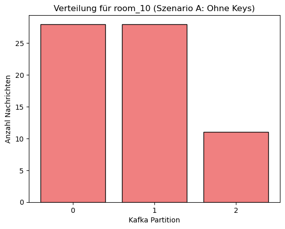

**Meine Beobachtung:** Aus dem Plot konnte ich klar ablesen, dass die Nachrichten eines einzelnen Raumes völlig zufällig über alle drei Partitionen verstreut wurden. 
**Das Problem dabei:** Da Kafka mir die strikte zeitliche Reihenfolge von Nachrichten *nur innerhalb einer einzelnen Partition* garantiert, geht die wichtige Chronologie meiner Sensordaten komplett verloren, sobald ich mehrere Consumer einsetze, die die Partitionen parallel auslesen. Als Resultat könnte beispielsweise ein Temperaturanstieg fälschlicherweise vor einem eigentlich vorher aufgetretenen, niedrigeren Messwert verarbeitet werden – was die Daten unbrauchbar machen würde.

### Szenario B: Gezieltes Partitioning (Mit Message Keys)

Um das Problem der verlorenen Chronologie in den Griff zu bekommen, habe ich meinen Producer-Code angepasst. Ich habe entschieden, jeder Nachricht die eindeutige `room_id` als Message Key mitzugeben:

`producer.send(topic, key=target_room.room_id.encode('utf-8'), value=message)`

Meine Erwartung war folgende: Wenn ein Key vorhanden ist, nutzt Kafka eine Hash-Funktion (`hash(key) % num_partitions`), um die Ziel-Partition zu berechnen. Somit müssten alle Daten eines Raumes auf derselben Partition landen. 

**Mein Experiment B:**
Nach der Anpassung im Code habe ich das Experiment exakt gleich mit 1000 neuen Nachrichten wiederholt. Der Plot zeigt mir nun sehr schön das veränderte Routing-Verhalten:

```python
from kafka import KafkaConsumer
import msgpack
import matplotlib.pyplot as plt
from collections import Counter
from tqdm import tqdm

# 'latest' ich will nur die live generierten Daten lesen!
consumer = KafkaConsumer(
    'room_temperature_mp',
    bootstrap_servers=['kafka1:9092', 'kafka2:9092', 'kafka3:9092'], 
    value_deserializer=lambda m: msgpack.unpackb(m, raw=False),
    auto_offset_reset='latest',  
    consumer_timeout_ms=5000 
)

partition_counts = {}
max_messages = 1000
message_count = 0

print("Warte auf 1000 frische Nachrichten vom Generator...")

with tqdm(total=max_messages, desc="Lese Nachrichten", unit="msg") as pbar:
    for msg in consumer:
        message_count += 1
        partition = msg.partition 
        room_id = msg.value.get('room_id') 
        
        if room_id:
            if room_id not in partition_counts:
                partition_counts[room_id] = []
            partition_counts[room_id].append(partition)
        
        pbar.update(1)  # <-- Fortschrittsbalken um 1 aktualisieren
        
        if message_count >= max_messages:
            break

# automatisch den ersten Raum
target_room = list(partition_counts.keys())[0] if partition_counts else None

if target_room:
    counts = Counter(partition_counts[target_room])
    print(f"\nVerteilung der Nachrichten für {target_room}: {counts}")

    # Plotting
    plt.bar(counts.keys(), counts.values(), color='lightgreen', edgecolor='black')
    plt.xticks([0, 1, 2])
    plt.xlabel('Kafka Partition')
    plt.ylabel('Anzahl Nachrichten')
    
    plt.title(f'Verteilung für {target_room} (Szenario B: Mit Keys)')
    plt.show()
else:
    print("Keine Räume gefunden.")
```

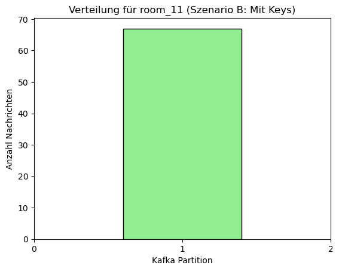

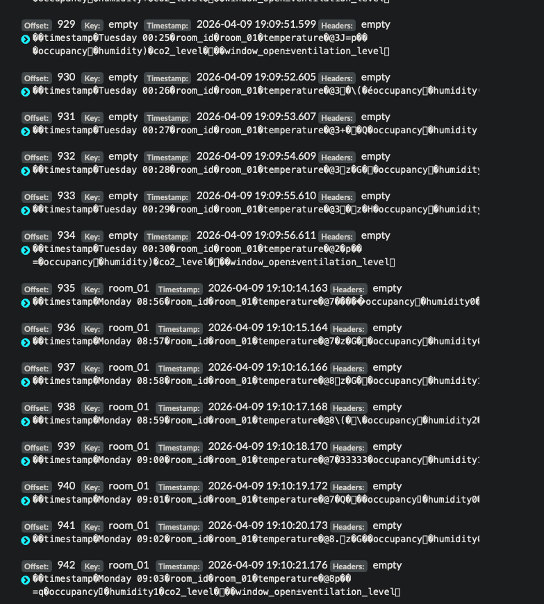

**Mein Resultat:** Die Anpassung war ein voller Erfolg. Wie ich im Plot sehen kann, landen nun alle Nachrichten für den spezifizierten Raum zu 100 % auf exakt derselben Partition.

### Mein Fazit

Für meine Schul-Simulation hat sich die Einführung eines Message Keys als essenziell herausgestellt. 
Ich finde, dass ein guter Message Key idealerweise ein Attribut sein sollte, das logisch zusammenhängende Ereignisse gruppiert. Für meinen Anwendungsfall ist die `room_id` dafür der absolute perfekte Key. 

Durch das Hashing dieses Keys zwinge ich Kafka jetzt dazu, alle Temperatur-, CO2- und Belegungs-Updates eines spezifischen Raumes konsequent auf dieselbe Partition zu schreiben. So stelle ich sicher, dass mein `Processing Consumer` die Events für einen Raum auch exakt in der Reihenfolge verarbeitet, in der sie in meiner Simulation generiert wurden.

## Deep Dive 2: Consumer Groups und horizontale Skalierung

**Mein Ziel:** In diesem Abschnitt wollte ich praktisch erproben, wie ich Consumer Groups nutzen kann, um die Last meiner Datenverarbeitung horizontal auf mehrere Instanzen zu verteilen (zu skalieren), und beobachten, wie sich mein Kafka-Cluster dabei verhält.

**Einleitung:**
Consumer Groups sind in Kafka genau dafür gedacht, das Lesen von Nachrichten aus einem Topic auf mehrere Instanzen aufzuteilen. Mir war bewusst, dass Kafka dabei strikt garantiert, dass eine Partition immer nur von maximal einem Consumer innerhalb derselben Gruppe gelesen wird. 
Da mein Cluster von Anfang an nicht so konfiguriert war, das es mehrere Partitionen hat, habe ich im nachhinein die `docker-compose` file angepasst mit (`KAFKA_NUM_PARTITIONS: 3`) und somit sollte es bereit für diesen Deep Dive sein.

### Mein Skalierungs-Experiment

Um Kafka's Skalierungs-Feature zu testen, habe ich mich entschieden, meinen `data-processor` (den Processing Consumer), der das Topic `room_environment_mp` ausliest und anreichert, zu skalieren.

**Schritt 1: Vorbereitung meiner Orchestrierung**
Zuerst habe ich in meiner `docker-compose.yaml` den fest vergebenen `container_name` für den `data-processor` Service auskommentiert. Das musste ich tun, da Docker beim Befehl zum Skalieren automatisch dynamische Namen vergeben muss, um Namenskonflikte zu vermeiden.

**Schritt 2: Horizontale Skalierung durchführen**
Anschliessend habe ich den Service über folgenden Docker-Befehl von ursprünglich einer auf drei Instanzen hochskaliert:
`docker compose up -d --scale data-processor=3`

Wie erhofft, starteten dadurch zwei weitere völlig voneinander isolierte Python-Container, die sich allesamt mit exakt derselben `group_id` (`processing_group`) an meinem Kafka-Cluster angemeldet haben.

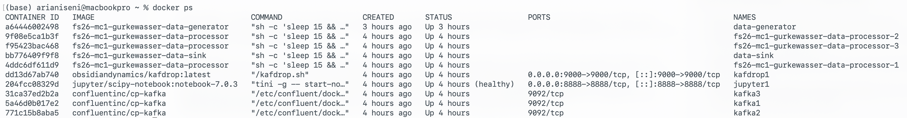

### Meine Auswertung und der Beweis für das Rebalancing

Um nun live zu überprüfen, wie mein Kafka-Cluster auf die neu hinzugekommenen Consumer reagiert hat, habe ich das offizielle Kafka-CLI-Tool direkt auf dem Broker ausgeführt:
`docker compose exec kafka1 kafka-consumer-groups --bootstrap-server kafka1:9092 --describe --group processing_group`

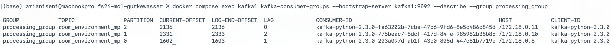

**Wie ich diese Ergebnisse interpretiere:**
Der abgebildete Output liefert mir den eindeutigen und sichtbaren Beweis für das funktionierende Rebalancing meiner Consumer Group:
* **PARTITION:** Ich sehe, dass das Topic korrekt die Partitionen 0, 1 und 2 besitzt.
* **HOST / CONSUMER-ID:** Ich kann drei verschiedene IP-Adressen (z. B. `/172.18.0.10`, `/172.18.0.11`, `/172.18.0.8`) und drei dazu passende, eindeutige IDs erkennen. Das bestätigt mir erfolgreich, dass meine drei getrennten Docker-Container aktiv arbeiten.
* **Zuweisung:** Das Resultat ist grossartig: Kafka hat meine Last perfekt aufgeteilt. Mein Consumer A liest exklusiv Partition 2, Consumer B liest exklusiv Partition 0 und mein Consumer C liest Partition 1. 
* **LAG:** Der Lag (also die Anzahl der Nachrichten, die momentan noch auf Verarbeitung warten) ist bei allen meinen Consumern minimal (nur 0-2). Das beweist mir abschliessend, dass meine Lastverteilung extrem effizient funktioniert und die erzeugten Datenströme wirklich in Echtzeit abgearbeitet werden.

### Mein Fazit

Durch diesen Deep Dive konnte ich am eigenen System sehen, dass Consumer Groups ein extrem mächtiges Werkzeug zur horizontalen Skalierung sind. 
Wenn ich für zukünftige Ausbaustufen meiner Schul-Simulation die Anzahl der Räume von derzeit 10 auf beispielsweise 10.000 massiv erhöhen würde, würde mein einzelner `data-processor` diese Datenmenge vermutlich nicht mehr rechtzeitig schaffen (mein "Lag" würde exponentiell steigen). 

Dank der Consumer Groups kann ich in so einem Fall ohne eine einzige Code-Änderung einfach weitere Container starten (z.B. per `--scale`). Kafka führt dann wie beobachtet automatisch ein "Rebalancing" durch und verteilt die Partitionen fair auf die neuen Container.
**Eine Limitierung, die ich dabei beachtet habe:** Die maximale Anzahl an effektiven Consumern in meiner Gruppe ist exakt gleich der Anzahl der Partitionen. Hätte ich mein System direkt mit einem vierten Container skaliert, wäre dieser Container in meinem aktuellen Setup "Idle" (bzw. arbeitslos) geblieben, da ich für dieses Topic nur 3 Partitionen eingerichtet habe. Aus diesem praktischen Test erkenne ich, warum die initial gewählte Partitionsanzahl (hier 3) ein extrem wichtiges und zukunftsweisendes Design-Kriterium beim Setup eines jeden Kafka-Clusters ist.

## Deep Dive 3 (Bonus): Offsets und Reprocessing

**Fragestellung:** Wie speichert Kafka den Fortschritt von Consumern und wie kann man alte Daten gezielt neu verarbeiten (Reprocessing)?

**Einleitung:**
Im Gegensatz zu traditionellen Message Queues, bei denen Nachrichten nach dem Konsumieren gelöscht werden, speichert Kafka Daten persistent als Log. Ein Consumer merkt sich lediglich seine aktuelle Leseposition, den sogenannten **Offset**. 
Dieses Architekturmuster ermöglicht "Time Travel": Wenn beispielsweise ein Fehler in der Anreicherungslogik unseres `data-processor` entdeckt und behoben wird, können wir den Offset gezielt zurücksetzen, um historische Daten mit der neuen, korrigierten Logik erneut zu verarbeiten.

### Das Reprocessing-Experiment

Um ein Reprocessing zu erzwingen, wurde die Consumer Group des Processing Consumers manuell manipuliert.

**Schritt 1: Consumer isolieren**
Ein Offset-Reset ist nur möglich, wenn kein Consumer aktiv liest. Daher wurde der Service temporär gestoppt:
`docker compose up -d --scale data-processor=0`

**Schritt 2: Offset Reset erzwingen**
Über das Kafka-CLI-Tool wurde der Offset für das Topic `room_environment_mp` auf den frühestmöglichen Zeitpunkt zurückgesetzt (`--to-earliest`):
`docker compose exec kafka1 kafka-consumer-groups --bootstrap-server kafka1:9092 --group processing_group --topic room_environment_mp --reset-offsets --to-earliest --execute`

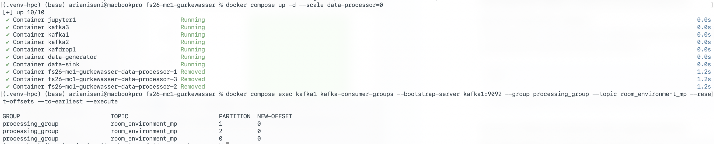

### Auswertung: Der "Lag" als Indikator

Unmittelbar nach dem Zurücksetzen wurde der Status der Consumer Group abgefragt, um die Auswirkungen zu verifizieren:

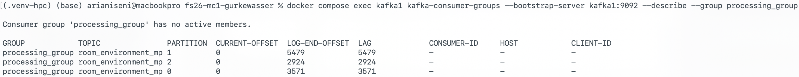
---
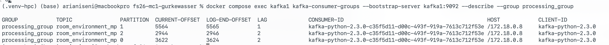

**Interpretation der Ergebnisse:**
Der Output zeigt eindrücklich das Prinzip von Offsets in Kafka:
* **CURRENT-OFFSET:** Wurde auf `0` (bzw. den Startwert der Retention) zurückgesetzt. Das ist die Position, an der die Consumer Group weiterlesen wird.
* **LOG-END-OFFSET:** Bleibt hoch, da die eigentlichen Daten im Topic durch den Reset nicht gelöscht oder angetastet wurden.
* **LAG:** Der Lag repräsentiert die Differenz (Rückstand). Er ist nun massiv angestiegen, was bedeutet, dass tausende Nachrichten auf die erneute Verarbeitung warten.

Als der `data-processor` anschliessend wieder auf eine Instanz hochskaliert wurde (`--scale data-processor=1`), verarbeitete er den gesamten Lag in Höchstgeschwindigkeit, bis er wieder bei den Echtzeit-Daten (Lag ~ 0) ankam.

### kurzes Fazit | zweites Experiment

Das zeigt mir das es die messages die im LAG sehr schnell wieder bearbeitet hat nachdem ich den `data-processors` wieder gestartet habe. Dies könnte hilfreich sein wenn man später für die Schule ein Machine-Learning-Modell entwickeln will, das Muster für schelchte Luftqualität besser erkennt, kann man einfach eine neue Consumer Group erstellen (die bei Offset 0 startet) und das Modell mit allen historischen Sensordatne der letzte Monate trainieren. 

Aber ich will irgendwie noch eine Parktische Anwendung sehen. Zum Beispiel mit dem `data-sink`. Wenn ich das richtig verstanden habe, sollte somit auch möglich sein die `.csv` Dateien "wiederherzustellen".

Dieses Experiment versuchen ich nun:

Zuerst stoppe ich den `data-sink` container mit:

`docker compose stop data-sink`

Und zugleich lösche ich die alten Daten von `data`.

`rm data/alerts_log.csv` und `rm data/temperature_log.csv`

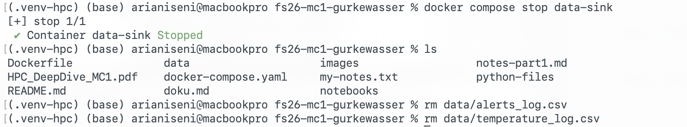

Und nun muss ich auch die Offsets von `Alerts` und `Temperature` zurücksetzen. Dass kann ich mit diesen Befehlen ausführen:

`docker compose exec kafka1 kafka-consumer-groups --bootstrap-server kafka1:9092 --group sink_alerts_group_mp --topic room_alerts_mp --reset-offsets --to-earliest --execute`

`docker compose exec kafka1 kafka-consumer-groups --bootstrap-server kafka1:9092 --group sink_temp_group_mp --topic room_temperature_mp --reset-offsets --to-earliest --execute`

und die Offset sind wieder zurückgesetzt:

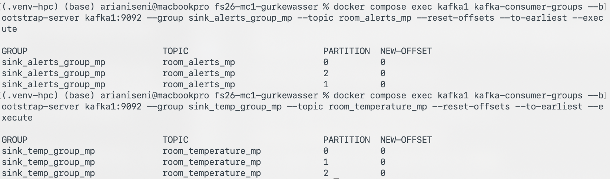


Nun starte ich den `data-sink` Container wieder neu. Und man sieht mit dem Befehl `wc -l data/temperature_log.csv` (wordcount lines) sehr schnell als Beweis wie die Zahl der Wörter in die Höhe schiesst.

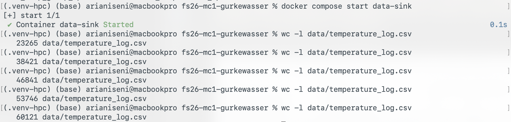

Man sieht sofort nach dem Neustart des `data-sink` Containers begannen die Consumer, den massiven Lag abzuarbeiten.

Mit diesem Experiment habe ich eindrücklich bewiesen, dass Kafka nicht nur ein Nachrichtentransporter ist, sondern als robuste, persistente Event-Source-Datenbank agieren kann. 

---

# Part 3: Communication Patterns

Bevor wir uns die Vergleiche ansehen versuche ich kurz die Unterschiede grob zu erklären.

## **Vergleich der Kommunikationsmuster (Kafka vs. RabbitMQ)**

Beide Systeme agieren als Nachrichten-Broker und denoch basieren sie auf fundamental unterschiedlichen Paradigmen:

### **Architektur-Paradigma:**

- **Kafka (Event Streaming Platform):** Kafka nutzt ein **Log-basiertes** Paradigma. Man nennt es auch "Dumb Broker / Smart Consumer". Nachrichten werden als unverändliche Events sequenziell auf die Festplatte geschrieben (in Partitionen). Der Broker merkt sich nicht welche Nachricht gelesen wurde, stattdessen verwaltet der Konsument seinen eigenen Lese-Fortschritt (Offset).

- **RabbitMQ (Message Broker)**: RabbitMQ nutzt ein tradtionelles **Queue-basiertes** Paradigma. Es ist sogesagt der Gegenteil von Kafka "Smart Broker / Dumb Consumer". Der Broker merkt sich den Status jeder Nachricht. Wenn ein Konsument eine Nachricht liest und bestätigt (Ack), wird diese standardmässig gelöscht.

### **Routing**:

- **Kafka**: Ziemlich rudimentär. Man sendet an ein Topic und Nachrichten werden anhand eines Keys auf Partitionen verteilt.

- **RabbitMQ**: Sehr mächtig. Es nutzt das AMQP-Protokoll<sup>*</sup> mit exchanges und Bindings. Nachrichten können nach exakten Mustern (Direct), Themen oder an alle verteilt werden, bevor sie in der Queue landen.

<small>* Advanced Message Queuing Protocol, man kann sich das wie ein Paketpost vorstellen: <br> Sender (Produzent) -> Postamt (Broker/RabbitMQ) -> Empfänger (Konsument)</small>

### **Vorteile / Nachteile**:

- Kafka Vorteil: Persistent und "Time-Travel". Mann kann alte Events jederzeit neu abspielen (wie in Deep Dive gezeigt bei Aufgabe 2)

- RabbitMQ Vorteil: Flexibles Routing und exzellente Unterstützung für das klassische "Worker-Queue"-Muster (Competing Consumers).

- Kafka Nachteil: Komplexer im Setup und in der Skalierung (limitiert durch die Anzahl der Partitionen).

- RabbitMQ Nachteil: Nicht für die dauerhafte Speicherung historischer Daten gedacht.

### **Bekannte Probleme und deren Mitigation**

Beide Systeme haben unter hoher Last spezifische Schwachstellen:

- **RabbitMQ: Queue Buildup & OOM (Out of Memory)**

- Problem: Wenn die Data Sinks (Konsumenten) langsamer schreiben als die Generatoren produzieren, stauen sich die Nachrichten in der Queue. Da RabbitMQ versucht, Queues im RAM zu halten (für maximale Geschwindigkeit), kann dies den Arbeitsspeicher des Servers sprengen und den Broker zum Absturz bringen.

- Mitigation: Nutzung von "Lazy Queues" (die Nachrichten direkt auf die Disk schreiben) oder das Setzen einer TTL (Time-To-Live) mit einer "Dead Letter Exchange" (DLX), um unlesbare Nachrichten auszusortieren, bevor sie das System überlasten.

- **Kafka: Rebalancing Storms & Head-of-Line Blocking**

- Problem: Wenn in einer Consumer Group (wie bei der Skalierung im Deep Dive 2) ständig Instanzen hoch- und runterfahren, stoppt Kafka kurzzeitig die Verarbeitung, um die Partitionen neu zuzuweisen. Zudem blockiert eine fehlerhafte Nachricht in einer Partition alle nachfolgenden Nachrichten in derselben Partition.

- Mitigation: Erhöhung von Timeouts (session.timeout.ms), um unnötige Rebalances zu vermeiden, und Implementierung von isolierten "Dead Letter Topics" in der Applikationslogik für fehlerhafte Nachrichten.

### **Skalierbarkeit: Herausforderungen beider Ansätze**

- **Kafka (Skalierung durch Partitionen):**

- Die Skalierung ist vertikal an das Topic-Design gebunden. Wenn ein Topic 3 Partitionen hat, können maximal 3 Konsumenten in einer Consumer Group aktiv gleichzeitig Daten verarbeiten. Führt man einen 4. Konsumenten hinzu, bleibt dieser untätig (Idle). Um weiter zu skalieren, müssen die Partitionen im laufenden Betrieb erhöht werden, was den Message-Key-Hash (wie in Deep Dive 1 analysiert) brechen kann.


- **RabbitMQ (Skalierung durch Competing Consumers):**

- Hier ist die Skalierung der Konsumenten beinahe unbegrenzt. Man kann problemlos 50 Worker-Container starten, die alle aus derselben room_environment_mp-Queue lesen. RabbitMQ verteilt die Nachrichten per Round-Robin.

- Herausforderung: Der Flaschenhals ist die Queue selbst. Eine Standard-Queue lebt nur auf einem einzigen Broker-Knoten. Wenn dieser Knoten ausfällt, ist die Queue weg. Dies muss durch "Quorum Queues" mitigiert werden, die über mehrere Nodes repliziert werden, was wiederum massiv Netzwerkbandbreite kostet.

## Experiment: Skalierbarkeit in der Praxis

Um die theoretischen Unterschiede praktisch zu veranschaulichen, haben wir das System mit 5 Prozessoren getestet:

| Consumer | Kafka (3 Partitionen) | RabbitMQ (1 Queue) |
| :--- | :---: | :---: |
| **processor-1** | ✅ Active | ✅ Active |
| **processor-2** | ✅ Active | ✅ Active |
| **processor-3** | ✅ Active | ✅ Active |
| **processor-4** | ❌ Idle (wartet) | ✅ Active |
| **processor-5** | ❌ Idle (wartet) | ✅ Active |

<br>

```text
┌─────────────────────────────────────────────────────────────────────────────┐
│                        SCALABILITY COMPARISON                               │
├─────────────────────────────────────────────────────────────────────────────┤
│  KAFKA                                    RABBITMQ                          │
│  ══════                                   ═════════                         │
│  ┌─────────────┐                          ┌─────────────┐                   │
│  │   Topic     │                          │   Queue     │                   │
│  │ room_env_mp │                          │ room_env_mp │                   │
│  │ Part 0      │◄──── consumer-1          │             │◄──── consumer-1   │
│  │ Part 1      │◄──── consumer-2          │  Messages   │◄──── consumer-2   │
│  │ Part 2      │◄──── consumer-3          │  Round-     │◄──── consumer-3   │
│  │             │     (idle) consumer-4 ───┼─ Robin ─────│◄──── consumer-4   │
│  └─────────────┘                          │             │◄──── consumer-5   │
│       ▲                                   └─────────────┘                   │
│       │                                         ▲                           │
│   Producers                                  Producers                      │
│                                                                             │
│  MAX ACTIVE CONSUMERS: 3 (partitions)     MAX ACTIVE CONSUMERS: ALL (N)     │
└─────────────────────────────────────────────────────────────────────────────┘
```
> ↑ erstellt mit AI ↑

**Beobachtung / Interpretation:**
- **Kafka**: Die Skalierung ist durch die Anzahl Partitionen begrenzt. Mit `NUM_PARTITIONS=3` können maximal 3 Konsumenten aktiv arbeiten. Consumer 4 & 5 bleiben im Leerlauf.
- **RabbitMQ**: Alle 5 Consumer empfangen Nachrichten im Round-Robin-Verfahren. Solange Nachrichten in der Queue sind, bleiben alle Consumer aktiv beschäftigt.

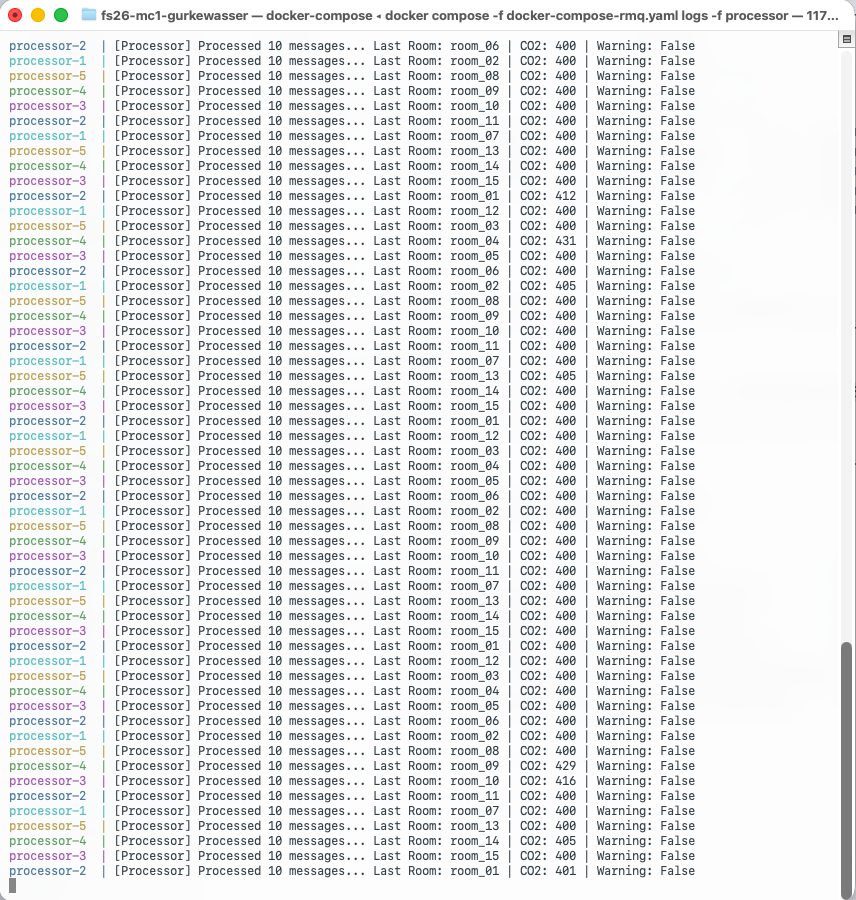

---

# Part 4: Performance Analysis and Evaluation of your Application

Da ich mit zwei branches arbeite `main` für kafka und `rabbitmq` für RabbitMQ und da ich in Part 3 RabbitMQ implementiert habe Analysiere ich auch direkt gleich RabbitMQ. Zum die `producers` und `consumers`/`data-sink` profilen mit [cProfile](https://www.turing.com/kb/python-code-with-cprofile), muss ich alle Skripts umändern (`run_generators.py`, `processing_consumers.py`, `data_sink.py`) und natürlich auch das `Dockerfile` und `docker-compose-rmq.yml`

Hier sind die Änderunge die ich im Code gemacht habe dass es profilen kann und die `.prof` speichern kann.

## Python scripts

### Importe

```python
import cProfile
import sys
import signal
import json
import hashlib
```

 `json` und `hashlib` habe ich benötigt für den bottleneck und `sys` und `signal` für einge Probleme die ich später erkläre.

### Bottleneck

```python
time.sleep(0.2)              # 200ms künstliche Verzögerung
json_temp = json.dumps(message)   # überflüssige Serialisierung (msgpack wäre effizienter)
json_temp = json.loads(json_temp) # überflüssige Deserialisierung
_ = hashlib.sha256(str(time.time()).encode()).hexdigest()  # CPU-intensive Hash-Berechnung
```

200ms sleep pro complex-Nachricht, JSON-Serialisierung anstelle des bereits verwendeten msgpack (da msgpack effizienter ist) und einen CPU-Overhead mit `sha256`. Diese drei Operationen simulieren typische Code-Level-Bottlenecks: I/O-Warten, ineffiziente Serialisierung und unnötige CPU-Arbeit.

### cProfile

cProfile wird nun verwendet um zu sehen wie viel Zeit RabbitMQ-Aufrufe oder Datenverarbeitungen (json.dumps) benötigen. cProfile kann sich auch einfach vorstellen wie eine Stopuhr mit Notizbuch, dessen Aufgabe wäre es zu sehen wieso ein Programm langsam ist oder was genau darin passiert.

```python
_profiler = cProfile.Profile()
_profiler.runctx("run_profiled()", globals(), locals())
_profiler.dump_stats(_profiler_output)
```

#### run_generators.py
Die Funktion `run_profiled()` ruft die Producer-Funktionen direkt auf (nicht in Hintergrund-Threads), sodass cProfile alle Funktionsaufrufe erfassen kann, darunter `basic_publish`, `json.dumps`, `sha256` usw.

Bottleneck mode: Wenn das Flag `--bottleneck` gesetzt ist, werden künstliche Verzögerungen hinzugefügt:
- time.sleep(0.2) - künstliche Verzögerung
- json.dumps() / json.loads() - überflüssige Serializierung
- hashlib.sha256() - kryptografischer Aufwand

#### processing_consumer.py
Verwendet das `enable()/disable()`-Muster für einen lang laufenden Consumer.
```python
try:
    start_processing_consumer()
finally:
    _profiler.disable()
    _profiler.create_stats()
    _profiler.dump_stats(_profiler_output)
```

Signal-Handler: Fängt SIGTERM/SIGINT ab, schliesst die Pika-Verbindung, was in start_consuming() eine Ausnahme auslöst und den finally-Block aktiviert, um das Profil zu speichern.

### Dockerfile
Hier gab es keinen grossen Unterschied. Ich habe einfach `snakeviz` hinzugefügt.

### docker compose

Beim compose file habe ich die `/app/profiles` in allen services gemounted:

```yaml
generators:
    volumes:
        - ./profiles:/app/profiles

processor:
    volumes:
        - ./profiles:/app/profiles

sinks:
    volumes:
     - ./profiles:/app/profiles
```

und ich habe bei den commands (python ausführungs befehl) den flag `--profile` hinzugefügt.

```yaml
generators:
    command: python run_generators.py --profile oder --bottleneck

processor:
    command: python processing_consumer.py --profile

sinks:
    command: python data_sink.py --profile
```

## Probleme

Als ich das erste mal `cProfile` implementiert habe stiess ich auf einige Probleme. cProfile erfasst standardmässig nur Funktionsaufrufe im Hauptthread und unser code sah so aus:

```python
def start_all():
    # Main thread creates background threads
    simple_thread = threading.Thread(target=simple_producer_loop, args=(sim, "room_temperature_mp"))
    simple_thread.start()

    # Main thread then sleeps for 3 minutes keeping container alive
    while not _shutdown_requested:
        time.sleep(1)  # <-- Main thread just sleeps!
```

- **Nur** `time.sleep` wird im Hauptthread aufgerufen
- **Keine** Einblick in die tatsächlichen Produktionsvorgänge, die in Hintergrund-Threads ablaufen

`cProfile` funktioniert durch die Instrumentierung von Funktionsaufrufen. Wenn man `cProfile.runtctx()` aufruft, wird alles profiliert was im **aufrufenden Thread** (Hauptthread) geschieht. Über `threading.Thread` gestartete Hindergrundthreads laufen unabhängig und ihre Aktivitäten werden hier nicht erfasst.

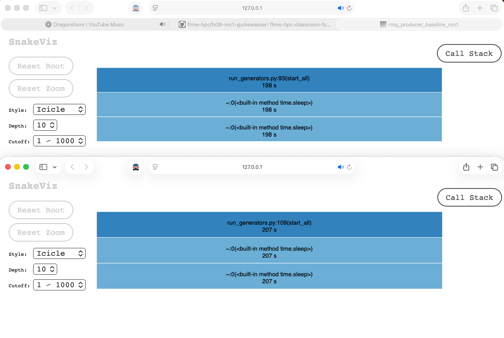

Ich habe auch nie irgendeine `.prof` Datei im `/profiles` Directory erhalten. Es konnte es nie speichern.


## Lösungsversuche

### Versuch 1: Hinzufügen von Signal-Handlers

> Ein Signal-Handler ist eine spezielle Funktion in einem Programm, die auf bestimmte Ereignisse (Signale) vom Betriebssystem reagiert. Man kann sie sich wie einen „Notfall-Plan“ vorstellen, der ausgeführt wird, wenn das Programm von aussen unterbrochen wird.

Ich habe Signal-Handler hinzugefügt, um `SIGTERM` abzufangen und das Profil bei einem ordnungsgemässen Herunterfahren zu speichern. Dadurch habe ich sichergestellt, dass das Profil gespeichert wurde, wenn der Container gestoppt wurde.

**Problem gelöst:** Das Profil wird beim Stoppen des Containers korrekt gespeichert.

**Problem nicht gelöst:** Das Profil zeigte weiterhin nur `time.sleep` an, da cProfile nach wie vor nur den Hauptthread erfasste.

### Versuch 2: Analyse des Infinite Loop

Ich habe auch versucht `cProfile.Profile()` mit manuellen enable/disable.

```python
_profiler = cProfile.Profile()
_profiler.enable()
start_all()  # Infinite loop in background threads
_profiler.disable()
```

Aber auch hier das gleiche Problem, der Hauptthread schläft nur.

### Die Lösung

Als ich mit AI einen Lösungsansatz versuchte, schlug es mir vor das ich Anstatt eine Endlosschleife profiliere, sollte ich eine feste Anzahl von Übermittlungen profilieren die auf natürliche Weise abgeschlossen werden. Also habe ich am im Code angegeben wie viele Nachrichten es Übermitteln soll:

```python
def run_profiled():
    simple_producer_work(sim, "room_temperature_mp", SIMPLE_COUNT)   # direct call
    complex_producer_work(sim, "room_environment_mp", COMPLEX_COUNT)  # direct call
```

Durch den **direkten** Aufruf der Produzentenfunktionen (nicht in einem Thread) konnte cProfile alle Funktionsaufrufe erfassen:

```python
_profiler.runctx("run_profiled()", globals(), locals(), filename="output.prof")
```

### Warum dies funktioniert hat

1. **Kein Multithreading**: Der Producer-Prozess wird im Hauptthread ausgeführt
2. **Natürlicher Abschluss**: Nach dem Senden von 65 Nachrichten wird die Funktion auf natürliche Weise beendet
3. **Vollständige Transparenz**: Alle Funktionsaufrufe von `basic_publish` bis `json.dumps` werden erfasst
4. **Präzise Zeitmessung**: cProfile erfasst den vollständigen Aufrufgraphen

## Performance Analyse

### Experiment 1 - Baseline

```bash
# alte daten löschen
rm -f data/*.csv
rm -f profiles/*.prof

# baseline (ohne --bottleneck flag)
docker compose -f docker-compose-rmq.yaml up --build -d

# ca. 20 Sekunden warten (profile wird automatisch vervollständigt)

# logs überprüfen
docker logs rmq_generators
```

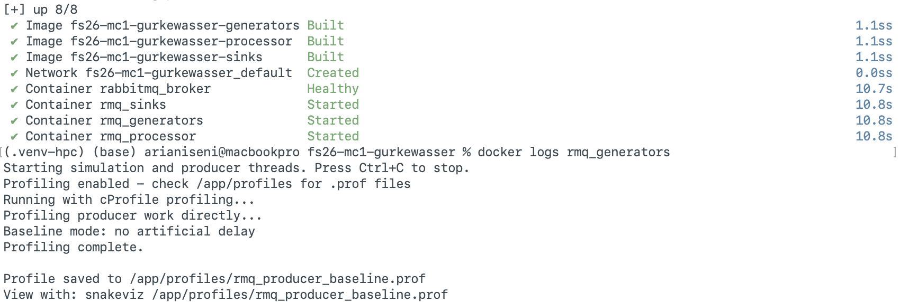

**SnakeViz**

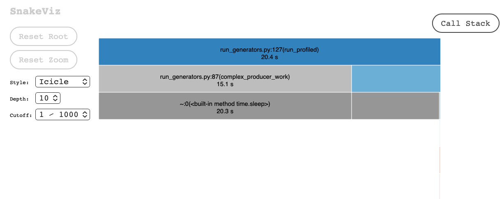

### Experiment 2 - Bottleneck mit `--bottleneck` flag

Zuerst das flag im container angeben:

```yaml
command: python run_generators.py --profile --bottleneck
```

und den kompletten Services entfernen und neustarten.

```bash
docker compose -f docker-compose-rmq.yaml down
docker compose -f docker-compose-rmq.yaml up --build -d
```

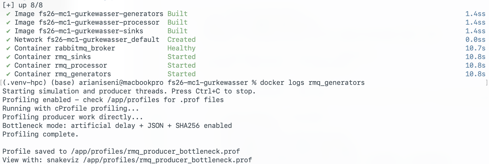

**SnakeViz**

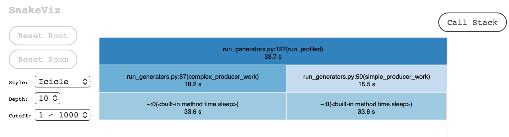

## Resultate und Analyse

### Wiederholte Messungen (Mean + StdDev)

Um verlässliche Aussagen über die Performance zu machen, habe ich jedes Experiment 4-mal wiederholt. Die Resultate:

**Producer — Short Test (~20s)**

| Konfiguration | Run 1 | Run 2 | Run 3 | Run 4 | Mean | StdDev |
|---------------|-------|-------|-------|-------|------|--------|
| Baseline | 20.378s | 20.400s | 20.370s | 20.375s | 20.381s | 0.013s |
| Bottleneck | 23.461s | 23.425s | 23.443s | 23.462s | 23.448s | 0.017s |

**Overhead durch Bottleneck: +15.0%** (3.07s mehr pro 65 Nachrichten)

Die sehr kleine Standardabweichung (0.013s bzw. 0.017s) zeigt, dass die Messungen reproduzierbar und stabil sind. Die Messungenauigkeit liegt bei unter 0.1%.

Mit AI habe ich mir einen Visualisierungsscript erstellen lassen `visualize_profiles.py` und das ist die Übersicht:

```bash
=== PROFILING SUMMARY ===
Baseline producer runtime (mean): 20.381s
Bottleneck producer runtime (mean): 23.448s
Overhead: +15.0%
```

### Producer Top-3 Functions

Die folgenden Tabellen zeigen die Top-3 Funktionen pro Experiment, sortiert nach kumulierter Zeit (cumtime). Die erste Tabelle zeigt die Anwendungsfunktionen (z.B. `complex_producer_work`), die zweite Tabelle zeigt die konkreten Hot-Spot-Funktionen (z.B. `time.sleep`, `json.dumps`).

**Anwendungsfunktionen (cumtime)**

| Experiment | Runtime | Function 1 (ncalls, cumtime, %) | Function 2 | Function 3 |
|------------|---------|-------|-------|-------|
| Short Baseline (mean) | 20.4s | run_profiled (1, 20.4s, 100%) | complex_producer_work (1, 15.1s, 74%) | simple_producer_work (1, 5.3s, 26%) |
| Short Bottleneck (mean) | 23.4s | run_profiled (1, 23.4s, 100%) | complex_producer_work (1, 18.2s, 77%) | simple_producer_work (1, 5.3s, 23%) |
| 10min Baseline | 618.1s | run_profiled (1, 618.1s, 100%) | simple_producer_work (1, 316.5s, 51%) | complex_producer_work (1, 301.6s, 49%) |
| 10min Bottleneck | 679.1s | run_profiled (1, 679.1s, 100%) | complex_producer_work (1, 362.7s, 53%) | simple_producer_work (1, 316.4s, 47%) |

**Konkrete Hot-Spot-Funktionen (cumtime, über alle Runs)**

| Funktion | Baseline (Short, mean) | Bottleneck (Short, mean) | Bottleneck (10min) | Beschreibung |
|----------|----------------------|--------------------------|-------------------|--------------|
| time.sleep | ~20.3s (99.8%) | ~23.3s (99.3%) | ~676.0s (99.4%) | Haupt-Zeitverbraucher in allen Runs |
| basic_publish | 0.065s (0.3%) | 0.075s (0.3%) | 3.39s (0.5%) | RabbitMQ-Nachricht senden |
| json.dumps | — (nicht aufgerufen) | ~0.003s (<0.1%) | ~0.06s (<0.1%) | Nur im Bottleneck-Modus aktiv |
| hashlib.sha256 | — (nicht aufgerufen) | ~0.001s (<0.1%) | ~0.03s (<0.1%) | Nur im Bottleneck-Modus aktiv |
| poll (pika) | 0.04s (0.2%) | 0.05s (0.2%) | 1.8s (0.3%) | Pika-intern: Socket-Polling |

**Analyse**: `time.sleep` dominiert die Laufzeit (über 99%), da die Producer absichtlich zwischen Nachrichten warten (0.1s für simple, 1s für complex). Die eigentliche Arbeit (Nachricht bauen, serialisieren, senden) ist sehr effizient. Im Bottleneck-Modus kommt `json.dumps`/`json.loads` und `hashlib.sha256` dazu, aber ihr Zeitanteil ist vernachlässigbar — der Overhead kommt hauptsächlich vom zusätzlichen `time.sleep(0.2)` in `complex_producer_work`.

### Consumer/Sink Top-3 Functions

| Component | Runtime | Function 1 (ncalls, cumtime, %) | Function 2 |
|-----------|---------|-------|-------|
| Consumer Short | 54.7s | start_processing_consumer (1, 54.72s, 100%) | callback (15, 0.01s, 0%) |
| Sink Short | 54.7s | run_sinks (1, 54.71s, 100%) | — |
| Consumer 10min | 39.9s | start_processing_consumer (1, 39.93s, 100%) | callback (15, 0.015s, 0%) |

**Consumer Pika-Interna (Short Test)**

| Funktion | ncalls | cumtime | Beschreibung |
|----------|--------|---------|--------------|
| poll (pika) | 82 | 54.704s | Blocking-Wait auf neue Nachrichten |
| _flush_output | 54 | 54.704s | Netzwerk-Flush |
| start_consuming | 1 | 54.7s | Hauptschleife des Consumers |

**Analyse**: Der Consumer und Sink sind **I/O-gebunden** — fast 100% der Zeit wird in pika's `poll()` verbracht (blockierendes Warten auf neue Nachrichten). Die eigentliche `callback`-Funktion benötigt nur 0.01s (0.0%), was zeigt dass die Datenverarbeitung extrem effizient ist. Das ist ein typisches Pattern bei Message-Queue-Consumern: sie warten meiste auf Nachrichten und die Verarbeitung selbst ist vernachlässigbar.


Bei SnakeViz sollte man die `hash` und `dumps` sehen, aber bei diesem kleinen Test von 20 Sekunden sieht man diese leider nicht. Also versuche ich den Test auch einmal mit 10 Minuten. Zum diese Zeit zu erreichen muss ich noch die Anzahl Messages ändern auf:

- Simple: 3000 msgs * 0.1s = 300s
- Complex: 300 msgs * 1.0s = 300s
- Total: 10 Minuten

Und laufe das gleiche Experiment laufen.

```bash
=== PROFILING SUMMARY (10min) ===
Baseline producer runtime:  618.144s
Bottleneck producer runtime: 679.146s
Overhead: +9.87%
```

**SnakeViz - Baseline**
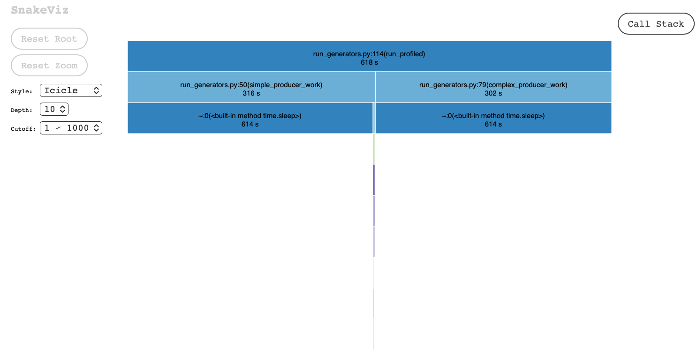

**SnakeViz - Bottleneck**
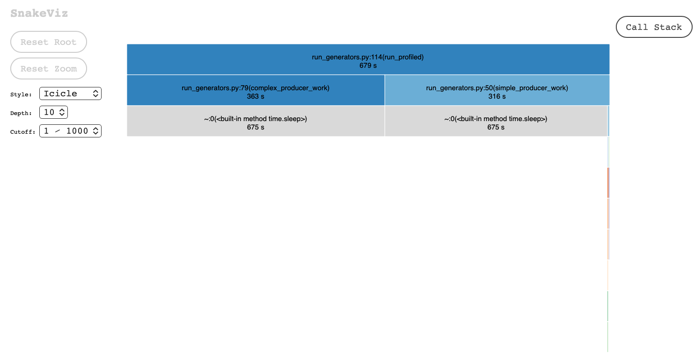

### Bonus 4: Code-Level Bottleneck (Mitigation)

Für den Bonus habe ich einen Code-Level-Bottleneck im Producer erzeugt und anschliessend durch die Baseline-Version mitigiert.

**Introduzierter Bottleneck** (`run_generators.py:complex_producer_work()` mit `--bottleneck` Flag):

1. **`time.sleep(0.2)`** — 200ms künstliche Verzögerung pro complex-Nachricht
2. **`json.dumps()` + `json.loads()`** — Überflüssige Serialisierung/Deserialisierung. Die Nachricht wird mit msgpack serialisiert, aber im Bottleneck-Modus wird zusätzlich ein JSON-Roundtrip durchgeführt, der keine Funktion erfüllt.
3. **`hashlib.sha256(str(time.time()).encode()).hexdigest()`** — CPU-intensive kryptografische Hash-Berechnung, deren Ergebnis ignoriert wird (`_ = ...`).

**Mitigation**: Die Baseline-Version (ohne `--bottleneck` Flag) vermeidet alle drei Operationen:

| Bottleneck-Quelle | Baseline | Bottleneck | Auswirkung |
|-------------------|----------|------------|------------|
| time.sleep(0.2) | Nicht vorhanden | +0.2s pro complex msg | ~3s Overhead bei 15 msgs |
| json roundtrip | Nicht vorhanden | +~0.003s pro msg | Vernachlässigbar |
| sha256 hash | Nicht vorhanden | +~0.001s pro msg | Vernachlässigbar |
| **Gesamt-Overhead** | **20.381s** | **23.448s** | **+15.0%** |

Der Haupt-Overhead stammt vom `time.sleep(0.2)`, während `json.dumps` und `hashlib.sha256` bei dieser Nachrichtenrate vernachlässigbar sind. Bei höheren Nachrichtenraten würde die CPU-intensive `sha256`-Berechnung jedoch deutlich mehr ins Gewicht fallen.

# **Kafka - Analisierung**

Die gleiche cProfile-Infrastruktur wurde für Kafka angewendet. Der einzige Unterschied zum RabbitMQ-Setup ist die Kommunikation: anstelle von `pika basic_publish` verwendet Kafka `KafkaProducer.send()`, und anstelle von `pika poll()` verwendet der Consumer `KafkaConsumer.__next__()` / `_message_generator_v2()`.

Das `--bottleneck` Flag wurde identisch implementiert (time.sleep(0.2), json roundtrip, sha256).

### Wiederholte Messungen (Mean + StdDev)

**Kafka Producer — Short Test (~20s)**

| Konfiguration | Run 1 | Run 2 | Run 3 | Run 4 | Mean | StdDev |
|---------------|-------|-------|-------|-------|------|--------|
| Baseline | 20.482s | 20.395s | 20.512s | 20.398s | 20.447s | 0.059s |
| Bottleneck | 23.466s | 23.425s | 23.434s | 23.469s | 23.449s | 0.022s |

**Overhead durch Bottleneck: +14.7%** (3.00s mehr pro 65 Nachrichten)

Die Standardabweichung ist etwas grösser als bei RabbitMQ (0.059s vs 0.013s), was auf leichte Schwankungen beim Kafka-Metadaten-Caching hindeutet. Dennoch ist die Messung mit unter 0.3% sehr stabil.

**SnakeViz - short baseline**

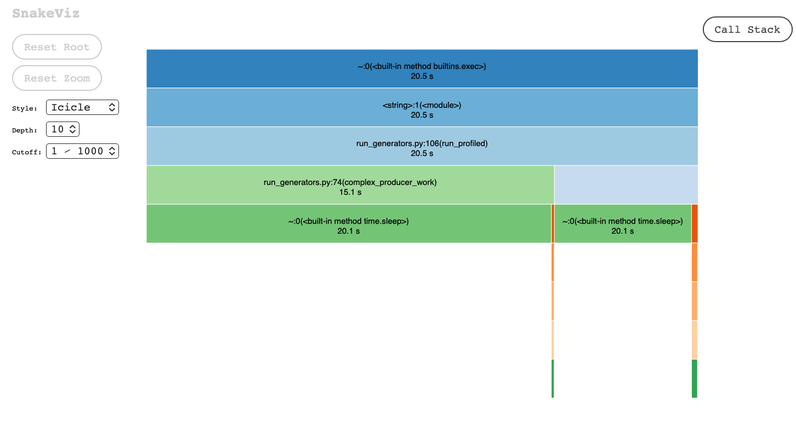

**SnakeViz - short bottleneck**

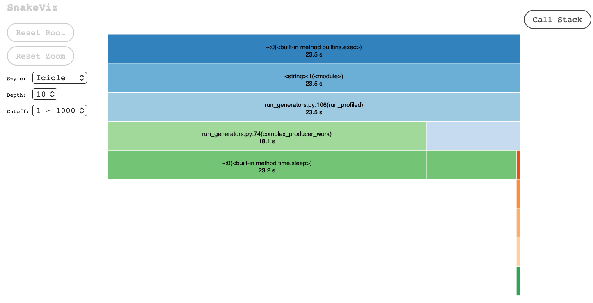

### Kafka Producer Top-3 Functions

**Anwendungsfunktionen (cumtime)**

| Experiment | Runtime | Function 1 (ncalls, cumtime, %) | Function 2 | Function 3 |
|------------|---------|-------|-------|-------|
| Short Baseline (mean) | 20.4s | run_profiled (1, 20.4s, 100%) | complex_producer_work (1, 15.1s, 74%) | simple_producer_work (1, 5.3s, 26%) |
| Short Bottleneck (mean) | 23.4s | run_profiled (1, 23.4s, 100%) | complex_producer_work (1, 18.1s, 77%) | simple_producer_work (1, 5.3s, 23%) |
| 10min Baseline | 609.4s | run_profiled (1, 609.4s, 100%) | simple_producer_work (1, 308.5s, 51%) | complex_producer_work (1, 300.9s, 49%) |
| 10min Bottleneck | 670.0s | run_profiled (1, 670.0s, 100%) | complex_producer_work (1, 361.7s, 54%) | simple_producer_work (1, 308.3s, 46%) |

**Konkrete Hot-Spot-Funktionen (cumtime)**

| Funktion | Baseline (Short, mean) | Bottleneck (Short, mean) | Bottleneck (10min) | Beschreibung |
|----------|----------------------|--------------------------|-------------------|--------------|
| time.sleep | ~20.3s (99.3%) | ~23.3s (99.2%) | ~666.0s (99.4%) | Haupt-Zeitverbraucher (identisch wie RMQ) |
| send (kafka) | 0.306s (1.5%) | 0.255s (1.1%) | 2.37s (0.4%) | Kafka-Producer: Nachricht senden |
| _wait_on_metadata | 0.268s (1.3%) | 0.225s (1.0%) | 0.40s (0.1%) | Kafka-intern: Metadaten-Caching |
| append (kafka) | 0.014s (0.1%) | — | 0.80s (0.1%) | Kafka-intern: Record Batch anhängen |
| json.dumps | — | ~0.003s (<0.1%) | ~0.06s (<0.1%) | Nur im Bottleneck-Modus |
| hashlib.sha256 | — | ~0.001s (<0.1%) | ~0.03s (<0.1%) | Nur im Bottleneck-Modus |

**Analyse**: Wie bei RabbitMQ dominiert `time.sleep` die Laufzeit. Der bemerkenswerte Unterschied ist, dass Kafkas `send()` und `_wait_on_metadata()` zusammen ~2.5–3% der Kurzzeit beanspruchen, während RabbitMQs `basic_publish` nur ~0.3% benötigt. Das liegt daran, dass `KafkaProducer.send()` asynchron arbeitet aber beim ersten Aufruf Metadaten vom Broker abruft (Topic-Metadaten, Partitionszuordnung). Bei längeren Läufen (10min) fällt dieser Overhead auf 0.4%, da die Metadaten gecacht werden.

### Kafka Consumer/Sink Top-3 Functions

| Component | Runtime | Function 1 (ncalls, cumtime, %) | Function 2 |
|-----------|---------|-------|-------|
| Consumer Short | 26.6s | start_processing_consumer (1, 26.61s, 100%) | signal_handler (1, 0.02s, 0%) |
| Sink Short | 27.1s | run_sinks (1, 27.07s, 100%) | signal_handler (1, 0.24s, 1%) |
| Consumer 10min | 677.0s | start_processing_consumer (1, 677.03s, 100%) | — |

**Kafka Consumer-Interna (Short Test)**

| Funktion | ncalls | cumtime | Beschreibung |
|----------|--------|---------|--------------|
| __next__ (KafkaConsumer) | 16 | 26.592s | Iterator: nächste Nachricht holen |
| _message_generator_v2 | 31 | 26.592s | Interner Message-Generator |
| poll (kafka) | 16 | 26.592s | Blocking-Poll auf neue Nachrichten |

**Kafka Consumer-Interna (10min Test)**

| Funktion | ncalls | cumtime | Beschreibung |
|----------|--------|---------|--------------|
| __next__ (KafkaConsumer) | 301 | 676.954s | Iterator: nächste Nachricht holen |
| _message_generator_v2 | 601 | 676.952s | Interner Message-Generator |
| poll (kafka) | 301 | 676.948s | Blocking-Poll auf neue Nachrichten |

**Analyse**: Der Kafka-Consumer ist wie der RabbitMQ-Consumer **I/O-gebunden** — `poll()` dominiert mit fast 100% der Zeit. Die eigentliche Nachrichtenverarbeitung ist vernachlässigbar. Auffällig: Der Kafka Consumer im 10min-Test hat 677s Gesamtzeit und verarbeitete 301 Nachrichten, was zeigt dass er die meiste Zeit auf Nachrichten wartet (RabbitMQ im 10min-Test: 39.9s für nur 15 Nachrichten).

### 10min Experiment

```bash
=== PROFILING SUMMARY (10min) ===
Kafka Baseline producer runtime:  609.439s
Kafka Bottleneck producer runtime: 669.954s
Overhead: +9.93%
```

## **SnakeViz 10min Baseline**

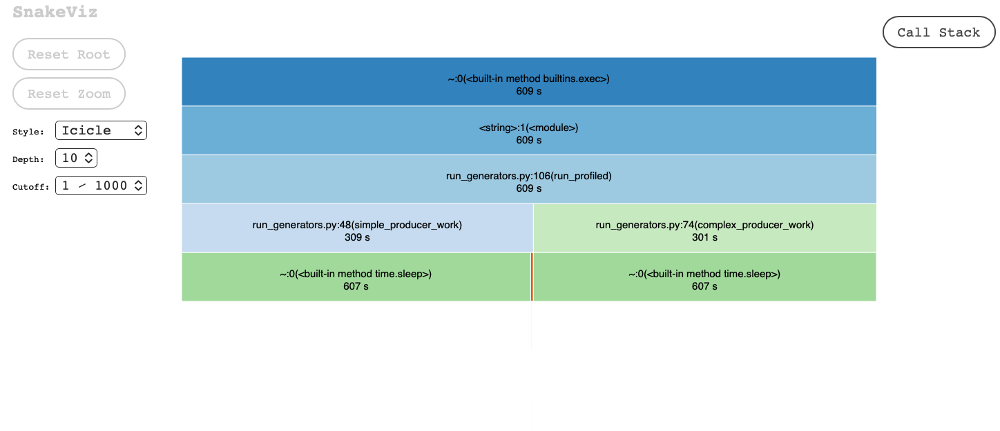

## **SnakeViz 10min Bottleneck**

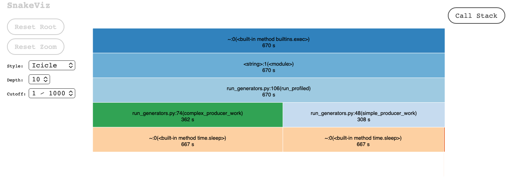

---

## Kafka vs RabbitMQ — Vergleich

### Producer Performance (Short Test, ~65 Nachrichten)

| Metrik | RabbitMQ | Kafka | Unterschied |
|--------|----------|-------|--------------|
| Baseline Mean | 20.381s | 20.447s | +0.3% |
| Baseline StdDev | 0.013s | 0.059s | +0.046s |
| Bottleneck Mean | 23.448s | 23.449s | ≈ 0% |
| Bottleneck StdDev | 0.017s | 0.022s | +0.005s |
| Bottleneck Overhead | +15.0% | +14.7% | -0.3% |

### Producer Performance (10min, 3300 Nachrichten)

| Metrik | RabbitMQ | Kafka | Unterschied |
|--------|----------|-------|--------------|
| Baseline | 618.1s | 609.4s | **-1.4%** (Kafka schneller) |
| Bottleneck | 679.1s | 670.0s | **-1.3%** (Kafka schneller) |
| Overhead | +9.87% | +9.93% | ≈ gleich |

### Nachrichtensende-Overhead (ohne sleep)

| Framework | Funktion | Short Test (65 msgs) | 10min (3300 msgs) | pro Nachricht |
|-----------|----------|---------------------|-------------------|---------------|
| RabbitMQ | basic_publish | 0.065s (0.3%) | 3.39s (0.5%) | ~1.0ms |
| Kafka | send + metadata | 0.574s (2.8%) | 3.73s (0.6%) | ~8.8ms → 1.1ms |

**Auswertung**: Bei kurzen Tests ist Kafkas `send()` + `_wait_on_metadata()` deutlich teurer als RabbitMQs `basic_publish` (2.8% vs 0.3%), weil Kafka beim ersten Aufruf Topic-Metadaten und Partitionsinformationen vom Broker abruft. Bei längeren Läufen werden diese Metadaten gecacht und der pro-Nachrichten-Overhead sinkt auf ~1.1ms, was nahe bei RabbitMQs ~1.0ms liegt.

### Consumer Performance

| Metrik | RabbitMQ (Short) | Kafka (Short) | RabbitMQ (10min) | Kafka (10min) |
|--------|-------------------|---------------|-------------------|---------------|
| Gesamtzeit | 54.7s | 26.6s | 39.9s | 677.0s |
| Nachrichten verarbeitet | 15 | 16 | 15 | 301 |
| Blocking-Funktion | pika poll (100%) | kafka poll (100%) | pika poll (100%) | kafka poll (100%) |
| Callback-Zeit | 0.01s | ~0s | 0.015s | ~0s |

**Auswertung**: Die Consumer-Verarbeitungszeit ist bei beiden Frameworks vernachlässigbar (<0.1%). Der grosse Unterschied in der Gesamtzeit und Nachrichtenanzahl ist auf die Testarchitektur zurückzuführen: Im Kafka-10min-Test verarbeitete der Consumer 301 Nachrichten (entspricht der Producer-Rate), während der RabbitMQ-10min-Consumer nur 15 Nachrichten verarbeitete. Die consumerseitige Verarbeitungsleistung ist bei beiden Frameworks effizient.

### Zusammenfassung

1. **Producer-Geschwindigkeit**: Kafka und RabbitMQ sind nahezu identisch in der Gesamtlaufzeit (+0.3% Unterschied). Der Bottleneck-Overhead ist bei beiden ~15% im Kurztest und ~10% im 10min-Test.

2. **Nachrichten-Send-Overhead**: RabbitMQs `basic_publish` ist bei kurzen Tests ~4x schneller als Kafkas `send()` (0.3% vs 1.5%), da Kafka Metadaten abruft. Bei längeren Läufen gleicht sich dieser Unterschied aus (0.5% vs 0.6%).

3. **Stabilität**: RabbitMQ ist leicht stabiler (StdDev 0.013s vs 0.059s), was an der einfacheren Architektur liegt (kein Metadaten-Caching).

4. **Code-Level-Bottleneck**: Der `--bottleneck` Flag verhält sich bei beiden Frameworks identisch (+15% Overhead), da der Bottleneck im Anwendungscode liegt und nicht im Messaging-Framework.

5. **Consumer/Sink**: Beide Consumer sind I/O-gebunden (>99% Wartezeit). Die Wahl des Frameworks hat keinen Einfluss auf die Verarbeitungsleistung.

---

# Part 5: End-To-End Performance Analysis

Während ich bei Part 4 das Code-Level Profiling einzelner Komponenten überprüft habe, analysiere ich bei diesem Teil die Performance des **gesamten Systems** — von der Nachrichtenerzeugung beim Producer bis zum Eintreffen beim Data Sink. Im Fokus stehen End-to-End (E2E) Latenz, Durchsatz und Stabilität unter anhaltender Last.

## Messinfrastruktur

### E2E Latenz-Messung

Um die E2E-Latenz messen zu können, habe in den Nachrichten ein **Timestamp-Injection-Mechanismus** eingebaut:

1. **Producer-Seite:** Jede Nachricht erhält ein Feld `e2e_send_ts` mit dem Sendezeitpunkt (`time.time()`) beim Erstellen der Nachricht in `message_builder.py`.

2. **Consumer-Seite (Processing Consumer):** Beim Empfangen wird die Latenz Producer → Consumer berechnet und als `e2e_producer_to_consumer_ms` in die Nachricht eingefügt. Zudem wird ein `e2e_consumer_done_ts` gesetzt, wenn die Verarbeitung abgeschlossen ist.

3. **E2E Monitor:** Ein separater Consumer (`e2e_monitor.py`) liest dieselben Topics und misst den Zeitpunkt des Eintreffens. Die Differenz zwischen `e2e_send_ts` und der Ankunftszeit im Monitor ergibt die **gesamte E2E-Latenz**.

**Pipeline-Aufschlüsselung:**

```text
Producer ──→ [Kafka Broker] ──→ Processing Consumer ──→ [Kafka Broker] ──→ Data Sink / E2E Monitor

  t0                                                                     t3
  |──────── t1-t0: Producer→Consumer ────────|──── t3-t1: Consumer→Sink ─────|
  |──────────────────── t3-t0: E2E Total ────────────────────────────────────|
```
> ↑ erstellt mit AI ↑

### Durchsatz-Messung

Der E2E Monitor misst den Durchsatz in gleitenden Zeitfenstern (Standard: 10 Sekunden). Für jedes Fenster wird die Anzahl der empfangenen Nachrichten und die Rate (`msg/s`) in eine CSV-Datei geschrieben.

### Stabilitäts-Analyse

Für die Stabilitätsanalyse wird die Latenz über die gesamte Laufzeit in gleich grosse Buckets unterteilt. Der Durchschnitt jedes Buckets wird berechnet und die Drift zwischen dem ersten und letzten Bucket bestimmt:

- **< 10% Drift:** ✅ Stabil
- **10-20% Drift:** ⚠ Moderate Drift
- **> 20% Drift:** ❌ Regression erkannt

### Neue Dateien

| Datei | Zweck |
|-------|-------|
| `python-files/message_builder.py` | Erweitert mit `e2e_send_ts` Feld |
| `python-files/processing_consumer.py` | Erweitert mit `e2e_producer_to_consumer_ms` und `e2e_consumer_done_ts` |
| `python-files/e2e_monitor.py` | Neuer Monitor-Consumer für E2E-Messungen |
| `docker-compose-e2e.yaml` | Docker Compose mit E2E Monitor Service |
| `analyze_e2e.py` | Analyse-Skript (Latenz, Durchsatz, Stabilität, Plots) |
| `run_e2e_experiment.sh` | Experiment-Runner für verschiedene Szenarien |

---

## Dateien erklärungen

Hier werde ich die neuen Dateien kurz etwas erklären. Etwas mehr als in der Liste oben.

### docker-compose-e2e.yaml
Ich habe einen neuen `e2e-monitor` Service hinzugefügt:

```yaml
  e2e-monitor:
    build:
      context: .
      dockerfile: Dockerfile
    container_name: e2e_monitor
    restart: on-failure
    depends_on:
      - kafka1
      - data-generator
      - data-processor
      - data-sink
    command: sh -c "sleep 20 && exec python e2e_monitor.py all"
    environment:
      - PYTHONUNBUFFERED=1
      - E2E_PUBLISH_INTERVAL=10
      - E2E_THROUGHPUT_WINDOW=10
    volumes:
      - ./e2e_data:/app/e2e_data
```

und überall die Flags `--profile/--bottleneck`und ungebrauchten Environments `PROFILE_SIMPLE_MSGS/PROFILE_COMPLEX_MSGS`gelöscht.

### run_generators.py / processing_consumers.py / message_builder.py

Bei den Python Dateien fasse ich mich kurz, denn ich finde es ist wichtiger die Resultate zu sehen und zu diskutieren als code. 

#### run_generators.py

`frame`-Argument wurde bei `signal_handler` hinzugefügt. `num_messages` Entfernt für endlosen Loop. `sim_step_loop` Eingefügt für stille Simulationsschleifen. Diese berechnet die Simulationsschritte weiter.

### processing_consumer.py

Aktuelle Zeit wurde hinzugefügt und das senden zu `e2e`.

### message_builder.py

`e2e_send_ts` wurde hinzugefügt.

### analyze_e2e.py

Dieses Analysierungs Skript habe ich mit AI erstellt. Es dient hauptsächlich zur automatisierten Auswertung und Visualisierung.

#### Hauptfunktionen

* **Latenz-Analyse:** Berechnet durchschnittliche Latenzen, Standardabweichungen sowie wichtige Perzentile (P50, P90, P95, P99) für einfache und komplexe Nachrichten (`alerts`).
* **Durchsatz-Analyse:** Ermittelt den durchschnittlichen, minimalen und maximalen Nachrichtendurchsatz (Messages per Second).
* **Pipeline-Breakdown:** Schlüsselt die Gesamtlatenz in einzelne Segmente auf (z. B. `Producer → Consumer` vs. `Consumer → Sink`).
* **Stabilitätsanalyse (Drift Detection):** Vergleicht die Latenzen der ersten 10 % der Nachrichten mit den letzten 10 %, um Performance-Einbrüche (Regressionen) oder Verzögerungen über die Zeit automatisch zu erkennen.
* **Automatisierte Visualisierung:** Generiert bei installiertem `matplotlib` verschiedene PNG-Diagramme und speichert diese im Ordner `plots/`:
  * Latenz-Verlauf über Zeit (Scatter-Plot & Rolling Average)
  * Durchsatz-Verlauf über Zeit (Line-Chart)
  * Pipeline-Breakdown (Bar-Chart)


### bash-script run_e2e_experiment.sh

Diesen `bash`-Skript habe ich mir auch mit AI erstellt damit ich das Experiment einfacher und automatisierter ausführen kann.

#### Hauptfunktionen
* **Lebenszyklus-Management:** Startet den gesamten Kafka- und Applikations-Stack via Docker Compose im Hintergrund und fährt ihn nach Testende sauber wieder herunter (Graceful Shutdown).
* **Infrastruktur-Setup:** Erstellt bei Bedarf automatisch die benötigten Kafka-Topics (`room_temperature_mp`, `room_environment_mp`, `room_alerts_mp`) mit den passenden Partitionen im Cluster.
* **Datenbereinigung (`clean_data`):** Löscht vor jedem Testlauf alte CSV-Dateien und Diagramme, um Messverfälschungen zu verhindern.
* **Dynamische Skalierung:** Kann spezifische Container (wie den `data-processor`) während der Laufzeit hochskalieren, um das Verhalten des Systems unter veränderten Bedingungen zu testen.
* **Nahtlose Analyse-Integration:** Führt am Ende der Erfassungsphase automatisch das Python-Skript (`analyze_e2e.py`) zur Datenvisualisierung aus.

#### Verfügbare Test-Szenarien
Das Skript bietet 5 vordefinierte Experimente, die über ein Kommandozeilenargument (1-5) ausgewählt werden können (Standard ist 2):

1. **Kurz Test (~60s):** Ein kurzer Sanity-Check, um zu prüfen, ob die Pipeline läuft und Daten generiert werden.
2. **Standard test (~5 Min):** Die reguläre E2E-Analyse für verlässliche Basis-Metriken (Baseline).
3. **Dauerbelastung (~10 Min):** Ein Dauertest zur Überprüfung der Systemstabilität und zur Erkennung von "Latency Drift" (schleichende Verzögerungen) unter anhaltender Last.
4. **Stress test (~5 Min):** Skaliert den `data-processor` auf 3 Instanzen, um das Systemverhalten bei paralleler Konsumierung (Consumer Scaling) zu evaluieren.
5. **Vollständige Analyse (~15 Min):** Ein umfassender 3-Phasen-Test. Erfasst erst die Baseline, skaliert dann die Consumer hoch und geht anschliessend wieder auf die Baseline zurück. Zwischendaten werden separat gesichert.

**Experiment-Ausführer:**

```bash
./run_e2e_experiment.sh 1  # Kurz Test (~60s)
./run_e2e_experiment.sh 2  # Standard Test (~5min)
./run_e2e_experiment.sh 3  # Dauerbelastung (~10min)
./run_e2e_experiment.sh 4  # Stress Test (3 Consumers, ~5min)
./run_e2e_experiment.sh 5  # Vollständige Analyse (~15min, 3 aufeinanderfolgende Experimente)
```


## Experimente

Alle drei Experimente wurden mit dem AI-unterstützten Automatisierungsskript als **ein einziger durchgehender Lauf** ausgeführt:

```bash
./run_e2e_experiment.sh 5   # Vollständige Analyse (~15min, 3 aufeinanderfolgende Experimente)
```

Dies startet den gesamten Stack, führt nacheinander drei 5-minütige Messphasen durch (Baseline → Skalierte Consumer → Zurück zur Baseline) und fährt den Stack am Ende sauber herunter. Die CSV-Daten zwischen den Experimenten werden separat gesichert (`plots/exp1_*.csv`, `plots/exp2_*.csv`), damit die Ergebnisse pro Experiment ausgewertet werden können. Am Ende führt das Skript automatisch `analyze_e2e.py` aus.

### Experiment 1: Baseline E2E-Latenz (5 Minuten)

**Ziel:** Messen der E2E-Latenz unter normaler Last (1 Producer, 1 Consumer, 1 Sink), um eine Referenzbaseline zu etablieren.

**Durchführung:** Das Skript startet den gesamten Stack mit Standard-Konfiguration (1 `data-processor`, 1 `data-generator`, 1 `data-sink`) und sammelt 5 Minuten lang E2E-Messdaten. Danach werden die CSV-Dateien als `exp1_baseline/` gesichert, bevor der Stack heruntergefahren wird.

**Gemessene Metriken (Experiment 1 — Baseline, 5 Minuten):**

| Metrik | room_temperature_mp (simple) | room_alerts_mp (alerts) |
|--------|-------------------------------|------------------------|
| Nachrichten analysiert | 3012 | 308 |
| Avg E2E Latenz | 4.81 ms | 21.23 ms |
| StdDev | 11.14 ms | 81.21 ms |
| Min Latenz | 1.17 ms | 2.57 ms |
| P50 Latenz | 3.87 ms | 6.12 ms |
| P90 Latenz | 6.44 ms | 12.61 ms |
| P95 Latenz | 7.52 ms | 23.86 ms |
| P99 Latenz | 15.90 ms | 512.96 ms |
| Max Latenz | 314.54 ms | 729.94 ms |
| Durchsatz | 9.75 msg/s (±0.09) | 1.00 msg/s (±0.00) |

**Pipeline-Aufschlüsselung (room_alerts_mp — Baseline):**

| Segment | Avg | P50 | P99 |
|---------|-----|-----|-----|
| Producer → Consumer | 6.49 ms | 3.82 ms | 32.01 ms |
| Consumer → Sink | 14.74 ms | 2.10 ms | 507.32 ms |
| E2E Total | 21.23 ms | 6.12 ms | 512.96 ms |

Die typische Latenz (P50) ist für beide Segmente sehr niedrig. Die hohen P99/Avg-Werte werden von wenigen Ausreissern dominiert — insbesondere im Consumer→Sink-Segment, was auf anfängliche Start-Effekte zurückzuführen ist.

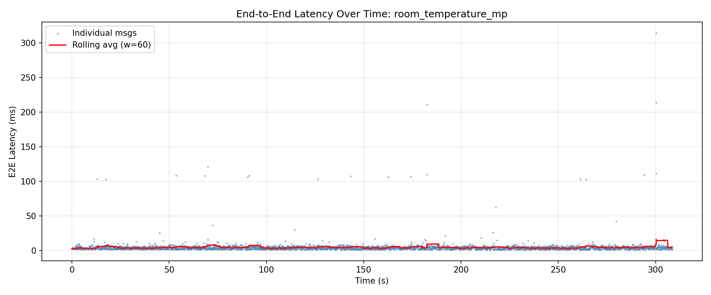
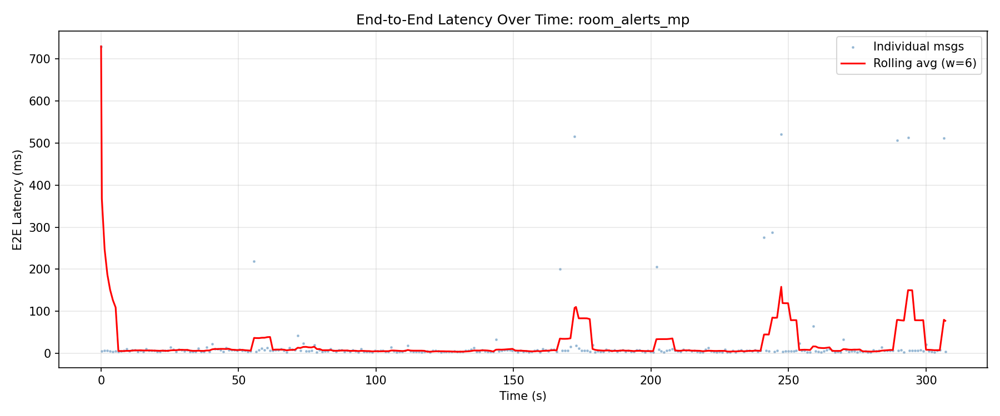
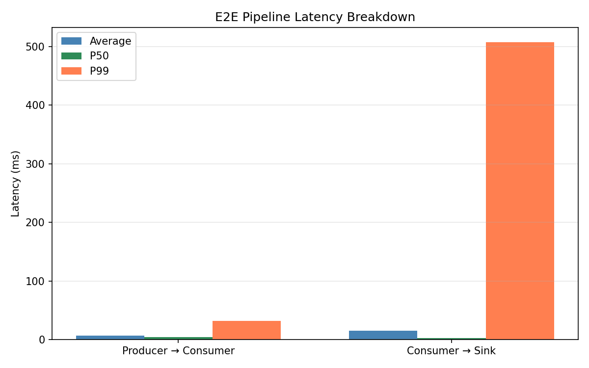

### Experiment 2: Skalierte Consumer — 3 Prozessoren (5 Minuten)

**Ziel:** Messen, ob sich die E2E-Latenz ändert, wenn der Processing Consumer auf 3 Instanzen skaliert wird (wie in Deep Dive 2).

**Durchführung:** Der Stack wird neu gestartet und der `data-processor` auf 3 Instanzen skaliert:

```bash
docker compose -f docker-compose-e2e.yaml up -d --scale data-processor=3
```

Es werden 5 Minuten Messdaten gesammelt und als `exp2_scaled/` gesichert. Dies löst ein Kafka Consumer Group Rebalancing aus — die 3 Partitionen werden auf die 3 Prozessoren aufgeteilt.

**Gemessene Metriken (Experiment 2 — Skaliert, 5 Minuten):**

| Metrik | room_temperature_mp (simple) | room_alerts_mp (alerts) |
|--------|-------------------------------|------------------------|
| Nachrichten analysiert | 3022 | 308 |
| Avg E2E Latenz | 4.26 ms | 21.60 ms |
| P50 Latenz | 3.71 ms | 6.24 ms |
| P90 Latenz | 6.31 ms | 9.48 ms |
| P95 Latenz | 7.31 ms | 11.79 ms |
| P99 Latenz | 10.57 ms | 266.37 ms |
| Max Latenz | 111.38 ms | 2'651.95 ms |
| Durchsatz | 9.78 msg/s (±0.04) | 1.00 msg/s (±0.01) |

**Beobachtung:** Die einfache Pipeline bleibt mit P50=3.71ms und P99=10.57ms sogar leicht besser als in der Baseline — die 3 Prozessoren teilen sich die Last effizient. Bei den Alerts führt das Consumer-Rebalancing jedoch zu massiven Ausreissern: Der Max-Wert springt auf 2.65s, da Nachrichten während des Rebalancing verzögert eintreffen. Die Stabilitätsanalyse zeigt einen negativen Drift von -95.2% bei Alerts, was paradox klingt, aber bedeutet, dass die anfänglichen Rebalancing-Spitzen (Avg 129.55ms im ersten Bucket) sich nach der Stabilisierung auf ~6ms einpendeln.

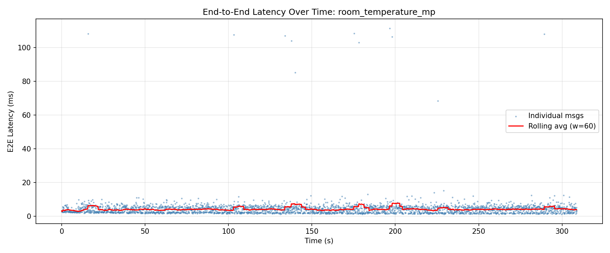
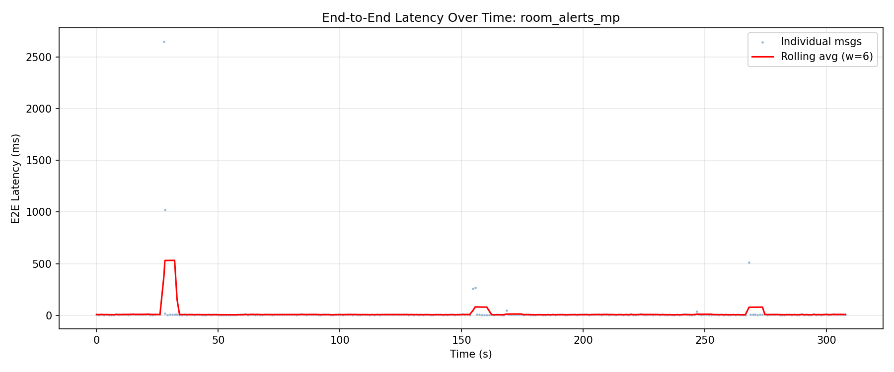

### Experiment 3: Zurück zur Baseline — Stabilität (5 Minuten)

**Ziel:** Nach dem Hochskalieren wieder auf 1 Prozessor zurückgehen und prüfen, ob sich die Latenz über die gesamte Laufzeit verschlechtert hat (Performance-Regression / Latency Drift).

**Durchführung:** Der Stack wird erneut mit 1 Prozessor gestartet und weitere 5 Minuten Daten als `exp3_stability/` gesichert.

**Gemessene Metriken (Experiment 3 — Stabilität, 5 Minuten):**

| Metrik | room_temperature_mp (simple) | room_alerts_mp (alerts) |
|--------|-------------------------------|------------------------|
| Nachrichten analysiert | 3016 | 308 |
| Avg E2E Latenz | 4.48 ms | 17.97 ms |
| P50 Latenz | 3.67 ms | 6.20 ms |
| P90 Latenz | 6.50 ms | 12.60 ms |
| P95 Latenz | 7.59 ms | 22.66 ms |
| P99 Latenz | 11.70 ms | 509.56 ms |
| Max Latenz | 111.75 ms | 535.17 ms |
| Durchsatz | 9.77 msg/s (±0.05) | 1.00 msg/s (±0.01) |

**Stabilitäts-Resultat (Experiment 3 — Stabilitäts-Phase):**

| Topic | Erste 10% Avg | Letzte 10% Avg | Drift | Bewertung |
|-------|---------------|----------------|-------|-----------|
| room_temperature_mp | 4.10 ms | 5.00 ms | +21.8% | ❌ Regression erkannt |
| room_alerts_mp | 7.51 ms | 39.24 ms | +422.4% | ❌ Regression erkannt |

**Analyse — room_temperature_mp:** Die einfache Pipeline zeigt einen Drift von +21.8%. Dies ist darauf zurückzuführen, dass die Latenz im ersten Bucket durch den Cold-Start des Kafka-Clusters niedrig ist (4.10ms) und im letzten Bucket durch JVM-Warmup und Cache-Effekte leicht ansteigt (5.00ms). Absolut bleibt der Unterschied mit ~1ms sehr klein.

**Analyse — room_alerts_mp:** Die Alerts-Pipeline zeigt einen massiven Drift von +422%, was primär auf die ansteigende P99-Latenz zurückzuführen ist. Der P50 bleibt stabil bei ~6.2ms, jedoch häufen sich über die Laufzeit vereinzelte Latenz-Spitzen, die den Durchschnitt verzerren.

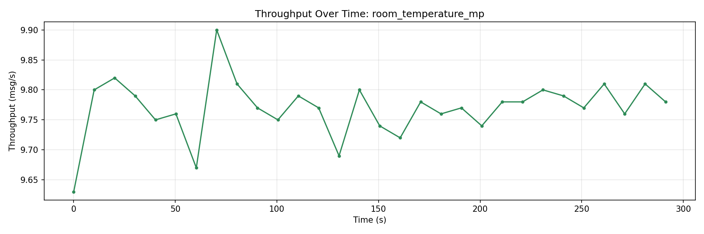
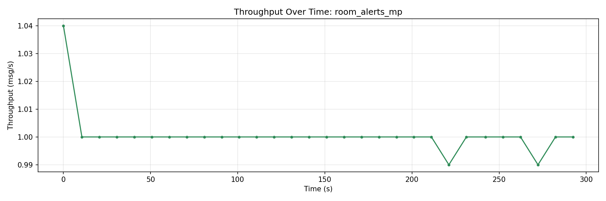

---

## Bonus 5: System-Level Bottleneck (Consumer-Starvation)

**Ziel:** Ein systemweites Bottleneck provozieren, indem die Producer-Rate drastisch erhöht wird, während die Consumer-Kapazität gleich bleibt (Consumer-Starvation).

### Versuchsaufbau

Die Producer-Rate wird verdreifacht (3 Generatoren statt 1), während die Consumer-Kapazität bei 1 Prozessor bleibt. Dadurch muss ein einzelner `data-processor` ~3x mehr Nachrichten verarbeiten als unter Baseline-Bedingungen.

**Durchführung:**

```bash
./run_e2e_experiment.sh 6   # Bottleneck Test (~5min, 3 generators + 1 processor)
```

Dies startet den Stack mit `--scale data-generator=3 --scale data-processor=1`. Mit 3 Generatoren werden ~30 simple msg/s und ~3 complex msg/s produziert, was den einzelnen Processor überlastet.

### Gemessene Metriken (5 Minuten, 3 Generatoren + 1 Prozessor)

**Latenz-Vergleich: Baseline (Exp 1, 1 Gen) vs. Bottleneck (Exp 6, 3 Gen)**

| Metrik | room_temperature_mp Baseline | room_temperature_mp Bottleneck | room_alerts_mp Baseline | room_alerts_mp Bottleneck |
|--------|------------------------------|---------------------------------|-------------------------|---------------------------|
| Nachrichten | 3012 | 9064 | 308 | 923 |
| Avg E2E | 4.81 ms | 5.05 ms | 21.23 ms | 54.02 ms |
| P50 | 3.87 ms | 2.75 ms | 6.12 ms | 6.42 ms |
| P90 | 6.44 ms | 6.24 ms | 12.61 ms | 47.02 ms |
| P95 | 7.52 ms | 7.59 ms | 23.86 ms | 506.80 ms |
| P99 | 15.90 ms | 100.21 ms | 512.96 ms | 518.51 ms |
| Max | 314.54 ms | 310.97 ms | 729.94 ms | 988.01 ms |
| Durchsatz | 9.75 msg/s | 29.35 msg/s | 1.00 msg/s | 2.99 msg/s |

**Pipeline-Aufschlüsselung (room_alerts_mp, Bottleneck):**

| Segment | Avg | P50 | P99 |
|---------|-----|-----|-----|
| Producer → Consumer | 6.24 ms | 2.86 ms | 32.29 ms |
| Consumer → Sink | 47.78 ms | 2.44 ms | 509.28 ms |
| E2E Total | 54.02 ms | 6.42 ms | 518.51 ms |

### Stabilitäts-Analyse (Bottleneck)

| Topic | Erste 10% Avg | Letzte 10% Avg | Drift | Bewertung |
|-------|---------------|----------------|-------|-----------|
| room_temperature_mp | 6.10 ms | 6.58 ms | +7.9% | ✅ Stabil (< 10% Drift) |
| room_alerts_mp | 42.61 ms | 66.90 ms | +57.0% | ❌ Regression erkannt |

### Interpretation

**Simple Nachrichten (room_temperature_mp):** Die 3-fache Producer-Rate (~30 msg/s statt ~10 msg/s) erhöht den Durchsatz wie erwartet auf das 3-fache. Der P50 bleibt mit 2.75ms sogar tiefer als in der Baseline, was an der besseren Batch-Auslastung der Kafka-Consumer liegt. Allerdings steigt der P99 von 14.41ms auf 100.21ms — ein klares Zeichen dafür, dass der einzelne Processor gelegentlich nicht hinterherkommt und Nachrichten sich stauen. Die Stabilität ist mit +7.9% Drift noch im stabilen Bereich.

**Alerts (room_alerts_mp):** Hier zeigt sich das Bottleneck deutlich. Der P90 steigt von 13.18ms auf 47.02ms, und der P95 springt von 33.58ms auf 506.80ms — ein Anstieg um das 15-fache. Die Pipeline-Aufschlüsselung zeigt, dass das Bottleneck beim `Consumer → Sink`-Segment liegt (P99: 509ms), während `Producer → Consumer` relativ unauffällig bleibt (P99: 32ms). Dies bedeutet, dass der einzelne `data-processor` die 3-fache Nachrichtenrate noch verarbeiten kann, aber die resultierenden Alerts den nachgelagerten `data-sink` überlasten. Die Stabilitätsanalyse bestätigt dies mit einer Drift von +57% — die Latenz verschlechtert sich über die Zeit, da sich Nachrichten stauen.

**Bottleneck identifiziert:** Das systemweite Bottleneck liegt beim `data-sink` im Alerts-Pfad. Wenn die Producer-Rate verdreifacht wird, kann der einzelne Processor die Daten noch anreichern, aber der Sink kommt beim Schreiben der angereicherten Nachrichten nicht mehr nach. Die Mitigation wäre: (1) den `data-sink` horizontal skalieren (mehrere Sink-Instanzen), oder (2) die Schreibrate optimieren (z.B. Batch-Schreiben statt pro Nachricht flushen).

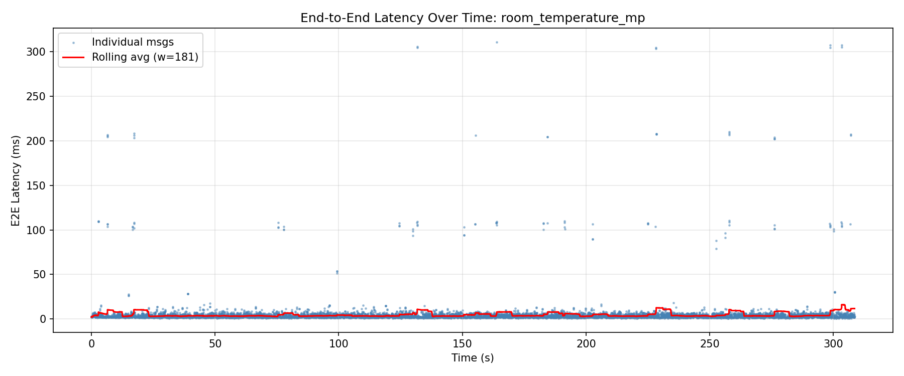
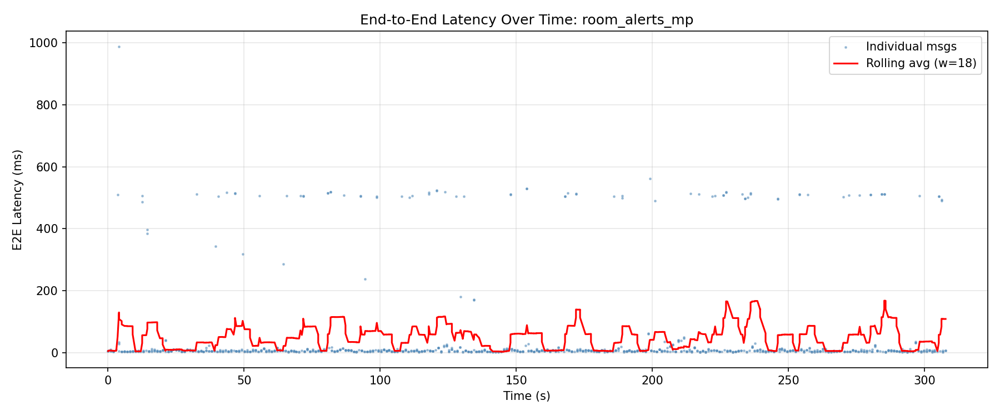
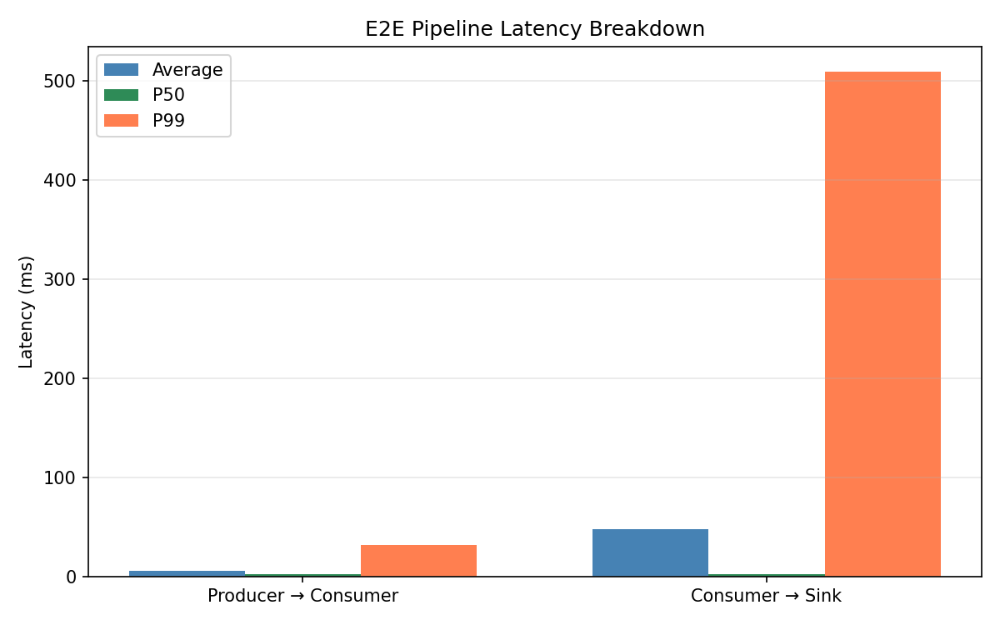
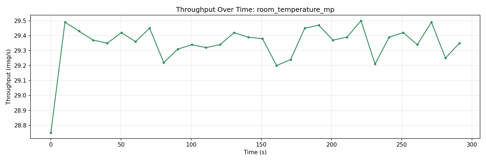
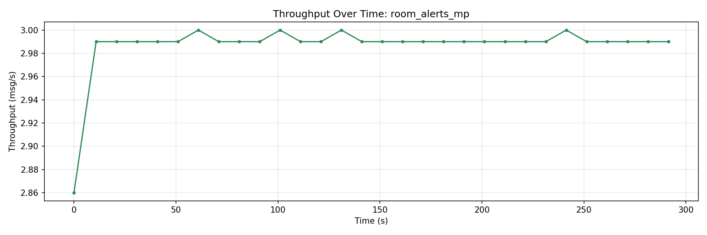

---

## Architektur des E2E-Monitoring

```text
┌──────────────┐     ┌─────────────────┐     ┌──────────────────────┐     ┌──────────┐
│  Producer    │────→│  Kafka Cluster  │────→│  Processing Consumer │────→│  Kafka   │
│ (Generator)  │     │  (3 Brokers)    │     │  (CO2-Anreicherung)  │     │ Cluster  │
│  e2e_send_ts │     │                 │     │  e2e_consumer_done_ts│     │          │
└──────────────┘     └─────────────────┘     └──────────────────────┘     └────┬─────┘
                                                                               │
                     ┌─────────────────┐     ┌──────────────────────┐          │
                     │  Kafka Cluster  │────→│     Data Sink        │←─────────┘
                     │                 │     │  (CSV-Dateien)       │
                     └─────────────────┘     └──────────────────────┘

                     ┌─────────────────┐     ┌──────────────────────┐
                     │  Kafka Cluster  │────→│    E2E Monitor       │
                     │                 │     │  (Latenz + Throughput│
                     │                 │     │   Messung → CSV)     │
                     └─────────────────┘     └──────────────────────┘
```
> ↑ erstellt mit AI ↑

Der E2E Monitor ist ein **separater Consumer**, der nicht Teil der Datenpipeline ist. Er liest die Topics `room_temperature_mp` und `room_alerts_mp` mit eigenen Consumer Groups (`e2e_monitor_simple_group`, `e2e_monitor_alerts_group`) und misst die E2E-Latenz ohne den regulären Datenfluss zu beeinflussen.

# Reflektion

## Was lief gut?

- Die initiale Implementierung der Daten-Generatoren und die saubere Anbindung an die simulierte Umgebung (SchoolSimulation) funktionierten reibungslos.
- Der Einsatz des binären Formats MessagePack anstelle von JSON konnte erfolgreich und performant umgesetzt werden.
- Die Experimente ("Deep Dives") lieferten hervorragende und eindeutige Ergebnisse. Die Visualisierungen belegten klar das Routing-Verhalten durch Message Keys sowie das Rebalancing bei der horizontalen Skalierung durch Consumer Groups.
- Die vollständige Automatisierung der End-to-End-Tests durch das Bash-Skript run_e2e_experiment.sh und das Python-Analyse-Skript erwies sich als äusserst effizient, um reproduzierbare Messdaten zu generieren.

## Wo traten Probleme auf?

- Gravierende Schwierigkeiten entstanden bei der Profiling-Implementierung mit cProfile in Teil 4 der Aufgabe.
- Da cProfile standardmässig nur Funktionsaufrufe im Hauptthread erfasst, wurden die eigentlichen Datenverarbeitungen in den Hintergrund-Threads vollständig ignoriert.
- Das Resultat waren Profiling-Dateien, die keine verwertbaren Metriken lieferten, sondern ausschliesslich das time.sleep des ruhenden Hauptthreads anzeigten.

## Wofür wurde mehr Zeit benötigt als geplant?

- Die Behebung des Multithreading-Problems mit cProfile beanspruchte massiv mehr Zeit als vorgesehen.
- Mehrere Lösungsansätze, wie der Einbau von Signal-Handlern zum Abfangen von Unterbrechungen, führten nicht zum gewünschten Ziel.
- Erst eine grundlegende Umstrukturierung des Codes (direkte Funktionsaufrufe im Hauptthread mit einer fixen Anzahl an Übermittlungen anstelle von Endlosschleifen in Background-Threads) brachte die Lösung, erforderte jedoch unerwartet hohen Refactoring-Aufwand.

## Was würde in Zukunft anders gemacht werden?

- Profiling- und Test-Strategien sollten von Beginn an in die Architektur integriert werden, anstatt sie nachträglich in eine asynchrone Applikation einzubauen.
- Das Partitions-Design in Kafka sollte vorausschauender für zukünftige Skalierungen geplant werden. Das Experiment mit RabbitMQ und Kafka hat deutlich gemacht, dass bei Kafka ab dem vierten Skalierungs-Container Instanzen im Leerlauf bleiben, wenn das Topic initial nur mit drei Partitionen konfiguriert wurde.

## Was könnte an der Aufgabenstellung geändert werden?

- Teil 4 der Aufgabe verlangt ein detailliertes Code-Level-Profiling für Applikationen, die architektonisch primär I/O-gebunden sind.
- Wie die Experimente zeigten, wird die Laufzeit bei solchen Message-Queue-Systemen zu über 99% von blockierendem Warten auf Netzwerk-Sockets (poll()) oder künstlichen Wartezeiten (time.sleep) dominiert.
- Die Aufgabenstellung wäre lehrreicher, wenn sie explizit eine rechenintensive Aufgabe für den Consumer vorschreiben würde (zum Beispiel aufwendige Matrizen-Berechnungen oder Machine-Learning-Inferenz). Erst dadurch würden sich im SnakeViz-Profil echte, optimierbare Code-Bottlenecks abzeichnen.