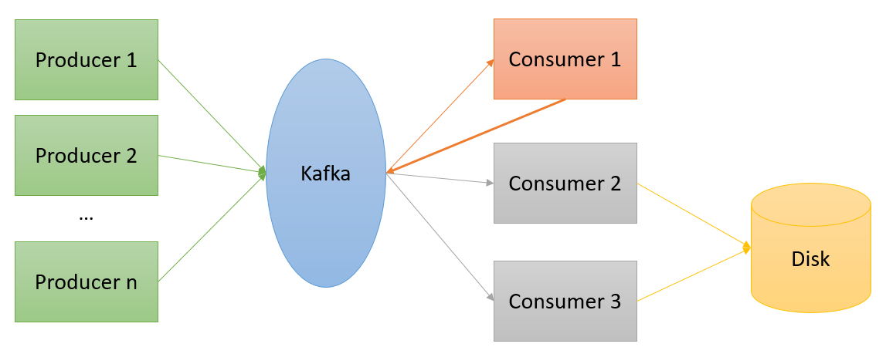

# Mini-Challenge 1 - High Performance Computing (hpc) FS26

## Containers, Communication Patterns/Frameworks and Performance Analysis

You design a micro service based application, which has multiple producers of data, as well as multiple different consumers of the data. To do this, you want to use the [Apache Kafka - Data Streaming Platform](https://kafka.apache.org/) in a first step. In a second step it will use a different communication pattern (and/or framework). The application runs distributed in different Docker containers. Define what kind of data your application has and what problem they want to solve with it. Describe the initial situation and the problem to be solved. Then implement your methods according to the tasks below. Write a short report and answer the questions of each of the 4 parts below. Include measurements/plots where meaningful.

Use GitHubClassroom to work on this mini challenge. The Github Classroom Link will be provided on [Spaces](https://spaces.informatik.fhnw.ch/spaces/high-performance-computing/beitraege)

### Intro to Kafka using Docker containers

1. Set up Kafka locally on your computer by using the provided Docker Compose file or create your own setup. Command line:`docker-compose up -d`. 

    We start with a Docker compose template, which launches 5 containers:

    * broker-[x] - Kafka brokers
    * jupyter    - Jupyter environment for the connection to our Kafka cluster using notebooks
    * kafdrop    - web UI for browsing and monitoring Kafka clusters

2. Open the Jupyter notebook on your machine using: http://127.0.0.1:8888. Start to play around with sending and receiving messages. Use [Kafdrop]( https://github.com/obsidiandynamics/kafdrop) to monitor/explore your cluster, topics, and messages. For example, start and stop individual brokers (e.g. via Docker Desktop) or change Kafka parameters such as the replication factor and watch how the cluster behaves via Kafdrop.

3. Make sure you understand how each container can talk to the other containers and how you can access a network interface of the containers.

### Part 1: Kafka Cluster and Application Setup

1. Write at least two different data generator functions, which regularly send messages containing data. One generator should send 10 messages at least every second (10Hz). Choose yourself which data is sent. The application of the data can be chosen freely, but choose a good mixture of a simple and a complex message. The data should be variable. The data generator can send simulated data or real data. Use suitable Kafka components and meaningful names of functions, variables etc. for the implementation. 

    Tips:
    * Use several notebooks so that you can start and stop the endless loops of data processing individually.
    * Use python programs rather than notebooks to automatically start the producers/consumers within their own containers.
    * After testing, stop the endless loop again, otherwise your computer resources are unnecessarily occupied or at the limit.

2. Write at least one data consumer that regularly reads and processes the data from the generators and re-inserts the processed data into the Kafka cluster, e.g., a calculation or a machine learning application on the retrieved data; a data enrichment; or the extraction or enrichment of information based on the message. Also, write at least two data sinks which process the retrieved data and store it to the disk, e.g. in a CSV file. Use appropriate Kafka components and meaningful names of functions, variables, etc. for the implementation. The image below shows a schematic overview over the basic implementation requirements.

3. Draw an overview of your application components including interfaces and data flows, for example using a component diagram. Write a proper architecture and design overview which answers at least the following questions.
    
      * What are the tasks of the components?
      * Which interfaces do the components have?
      * Why did you decide to use these components? 
      * Are there any other design decisions you have made? Which requirements (e.g. libraries, hardware, ...) does a component have?
      * Which features of Kafka do you use and how does this correlate to the cluster / topic settings you choose?
      * Describe the Docker setup of your application.

#### Bonus 1
Use more efficient serializers/deserializers than JSON for the messages.

### Part 2: Performance Analysis and Evaluation of Kafka

In this part you will adjust the application you developed in part 1. In the following list you find a multitude of "Deep Dives" where you use advanced Kafka topics. Use at least two of them and apply those on your application.   

* Consumer Groups
* Find out the limits of send/receive of your application (and of Kafka in general)
* Distribution of brokers and partitions
* Replication factors and partition counts
* Offset/Reprocessing
* Retention/Compaction
* Kafka Streams
* Retries
* What does a message key look like and how should it be designed?

Perform different experiments with your chosen DeepDives with different configurations/scenarios and describe the results. Conclude with effective use cases for those features in case your own application is not really a use case for them.

#### Bonus 2
Make more than 2 DeepDives.

### Part 3: Communication Patterns

1. Rewrite your application of part 1 using another communication framework such as RabbitMQ and/or another underlying messaging protocol such as ZeroMQ or MQTT.
    
2. Pack your rewritten application into containers.

3. Answer the following questions and interpret your experiments or results: 
      * Compare the communication patterns of Kafka and your chosen technology. Where are they similar, where different? How do those patterns work? Are there advantages or disadvantages of those patterns? 
      * Are there any known issues with those patterns? If yes, how could those issues be mitigated or on the other hand provoked? If possible, show this with an experiment.
      * How scalable are those two approaches? What challenges need to be considered? 

#### Bonus 3
Show how your container setup could be integrated into a container orchestration system (such as Kubernetes) and how it would profit from this. Or show how you could replace some of the components with cloud-based offers and what changes/considerations come with this.

### Part 4: Performance Analysis and Evaluation of your Application

Profile your producers and consumers/data sinks. Describe the patterns and bottlenecks you see while executing different scenarios and workloads. Perform 2-3 experiments with different configurations and compare the performance of your implementation from part 1 with the performance of your implementation from part 3.
Focus on the code-level performance of individual producers and consumers in isolation.

  Some example experiments:
  
  * Measure the average time incl. standard deviation required by your producer/consumer loop over several runs.
  * Determine which call of your producer/consumer takes the most time. Which 3 methods are called the most or need the most time and how much time?
  * Create a profile of your producer/consumer code in a xxxxx.prof file and create 1-2 visualizations of the profile (e.g. with [SnakeViz](https://jiffyclub.github.io/snakeviz/)) to which you explain in the context of the profiling work.

#### Bonus 4
Mitigate or produce a code-level bottleneck in a single component.

### Part 5: End-To-End Performance Analysis

While Part 4 looked inside individual components, this part measures the system as a whole — end-to-end latency, throughput, and stability under sustained load.
Profile your full application including producers, consumers and the transmission between those. Analyze how your application behaves under load and try to find possible or probable bottlenecks. How well does the application work? Does it keep performing well even after some time or is there a performance regression? All in all, does your application work performant?

#### Bonus 5
Mitigate or produce a system-level bottleneck (e.g., saturate a topic, starve a consumer group).

## Reflection

Write a reflection on the realization of the mini-challenge. What went well? Where did problems occur? Where did you need more time than planned? 
What would you do differently in the future? What would you change in the assignment? Give examples in each case.

### Further Resources

* Kafka crash course: https://youtu.be/R873BlNVUB4
* Getting started with Kafka: https://towardsdatascience.com/getting-started-with-apache-kafka-in-python-604b3250aa05
* In-depth Kafka online course: https://www.udemy.com/course/apache-kafka/
* Excellent guide on low level communication patterns: https://zguide.zeromq.org/
